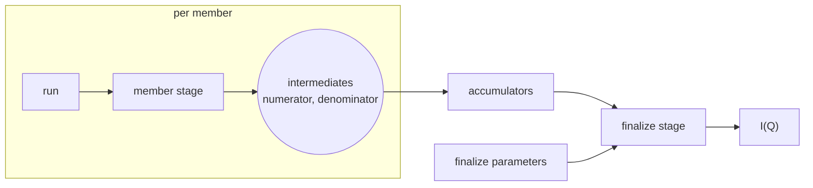

# Aggregation over runs

This document covers how results from several runs are combined into one: a sum over runs in SANS, a stitch over angles in reflectometry, a series that grows while the experiment is running.
It is the detail behind ["Aggregation over runs" in architecture.md](architecture.md#aggregation-over-runs).

## The shape of a sum over runs

The ESS workflows combine runs in different places, but the additive cases share one shape.

| Workflow | What it combines | How |
|---|---|---|
| ess.sans | numerator and denominator of I(Q), over runs | events by concatenation, dense data by summation, normalisation once after the merge |
| ess.reflectometry | runs at the same angle; then angles | events by concatenation; then a global fit of scale factors over all curves, which is not additive |
| ess.powder | nothing yet | normalises per run, upstream of where a sum would go |
| ess.bifrost | angle groups inside one run | events grouped by rotation and concatenated |



A stage per member computes one or more intermediates.
The intermediates of all members are accumulated.
A finalize stage turns the accumulated values into the outputs.
Normalisation sits in the finalize stage, so there are usually two intermediates, a numerator and a denominator.
Dimensionality and event mode do not change the shape: a 4D volume adds like a curve, and concatenation is accumulation for binned data.

sciline's `Aggregation` (scipp/sciline#245) is this shape as an object: a contribute stage, one accumulator per intermediate, which sciline calls an accumulation key, and a finalize stage.
An `Aggregation` holds nothing between calls, so whoever loops over the members holds the accumulators.

## Inside one run, or across stage records

An aggregation appears in one of two places, never half in each.

**Inside one run**, the workflow code runs `Aggregation.compute` itself, and the framework sees an ordinary spec.
This is for members the framework has no records for: angle groups inside a Bifrost run, chunks of an NMX file.

**Across stage records**, each member has a stage record of its own.
Members then run in parallel, a series grows by one member without reducing the others again, and a member can be removed.
This is for runs, and the rest of this document is about it.

## Member stages and a finalize stage

An aggregation needs no spec of its own.
The spec exposes the values that add as intermediates ([workflow-contract.md](workflow-contract.md#changes-to-the-spec-of-scippess690)), and the binding gives an accumulator for each.
A client sets every parameter but the member's with `client.workflow`, and cuts two stages from it:

```python
wf = client.workflow(NORMALIZE, {'floor': 1.5, 'scale': 2.0})     # 'run' left unset

member = wf.stage(inputs=['run'], outputs=['numerator', 'denominator'], label='members')
members = [member.compute({'run': r}) for r in runs]               # dispatched in parallel

finalize = wf.stage(inputs=['numerator', 'denominator'], outputs=['normalized'], label='total')
total = finalize.compute({
    name: Accumulate(accumulate=[m.ref(name) for m in members])
    for name in ('numerator', 'denominator')
})
client.output(total, 'normalized')
```

This is `sciline.Aggregation(pipeline, members=[RunFile])`: `member` is its contribute stage and `finalize` its finalize stage.
Outside a session each `compute` is dispatched and returns at once, and the finalize stage record waits for its members as [pending outputs](records.md#scheduling-pending-outputs-as-inputs).

**`Accumulate` is a stage input whose value is the accumulation of the outputs it lists.**
The binding resolves it with the accumulator the author gave for that intermediate, in the order listed.
The framework never adds arrays, never chooses between summation and concatenation, and never places normalisation.

Whether an intermediate holds events or a histogram is the author's choice.
Events keep the binning a parameter of the finalize stage, and cost memory and disk.
A histogram fixes the bins in the member stage, and is small.
The framework does not see the difference.

A parameter that only the finalize stage reads, and that a person wants to change after the members ran, is left out of `wf` and made an input of the finalize stage:

```python
wf = client.workflow(NORMALIZE, {'floor': 1.5})                    # 'run' and 'scale' not given
finalize = wf.stage(inputs=['numerator', 'denominator', 'scale'], outputs=['normalized'])
```

The members' records hold the default of `scale`, filled at submit, which their stage does not read.
The finalize takes `scale` as a stage input, so the agreement below does not compare it.

## Members agree on their parameters

Members and finalize made from one `wf` share every parameter they do not take as a stage input: the same masks, the same direct beam, the same wavelength bins.
**The backend refuses an intermediate from a stage record of the same spec that disagrees with the consuming request on a parameter both set in `params`,** and names that parameter.
Both sides are compared as recorded, defaults filled, so a member that omitted a default agrees with a finalize that gives it.
A parameter one side takes as a stage input, such as the members' `run`, is not compared.
The check is made at validation and without workflow code.

A correction that changes a shared parameter, such as better masks, gives another workflow ID, and all members run again with it.
sciline does the same: a changed pipeline parameter means a new `Aggregation`.

A workflow with two member tables, such as sample runs and background runs in ess.sans, is two member stages cut from one `wf` and one finalize stage:

```python
wf = client.workflow(SANS_WITH_BACKGROUND, {'masks': masks, 'direct_beam': db, 'q_bins': 100})
sample = wf.stage(inputs=['sample_run'], outputs=['sample_numerator', 'sample_denominator'])
background = wf.stage(inputs=['background_run'],
                      outputs=['background_numerator', 'background_denominator'])
finalize = wf.stage(inputs=['sample_numerator', 'sample_denominator',
                            'background_numerator', 'background_denominator'],
                    outputs=['iofq'])
```

## When chaining is valid

A series that grows by one run per arrival should not read every member again.
A finalize stage may name an accumulated intermediate as an output as well as an input.
`sciline.Stage` passes such a value through, so the finalize stage record stores the accumulated value, and the next finalize accumulates it with the new member:

```python
finalize = wf.stage(inputs=['numerator', 'denominator'],
                    outputs=['numerator', 'denominator', 'normalized'])
finalize.compute({
    name: Accumulate(accumulate=[previous.ref(name), new.ref(name)])
    for name in ('numerator', 'denominator')
})
```

This is correct if accumulating a pre-accumulated value gives the same result as accumulating its parts.
That is associativity, a property of the accumulator and not of the spec.
sciline's `Accumulator` contract already requires it, and `ess.apps.testing.assert_accumulator_is_associative` checks it.
Commutativity is not required, because a chain keeps the order in which members arrived.

The **current members** of a series are a query: the latest stage record per member key under the label, leaving out failed, cancelled, and excluded ones.
A finalize over all current members is always correct.
A **chained** finalize accumulates the previous finalize's values and every current member that the previous finalize does not cover.
`apply` decides between the two (`ess.apps.batch._finalize`):

```python
def elements_of_next_finalize(series):
    current = current_members(series)                  # stage records
    previous = latest_finalize(series)
    if previous and covers(previous) <= current:
        return [previous] + [m for m in current if m not in covers(previous)]
    return current

def covers(finalize):                                  # follow the Accumulate back
    return union(covers(producer(ref)) if is_finalize(producer(ref)) else {producer(ref)}
                 for ref in finalize.inputs[accumulate[0]].accumulate)
```

- **The comparison is between stage records, not member keys.**
  A corrected member has a new stage record, so the previous finalize covers a record that is no longer current.
  The check fails, and the next finalize accumulates all current members.
  The same happens when a member is excluded or reprocessed under a new rule version.
  Removing a member is therefore never a subtraction.
- **A failed or cancelled finalize is never chained onto.**
  Otherwise one transient failure would end the series.
- **Two arrivals close together cannot lose a member.**
  The later finalize accumulates every current member that the previous finalize does not cover, not only the newest.
- **A chained element is recognised without a declaration.**
  A finalize is a stage record whose inputs include an `Accumulate`.
- **The walk reads metadata only**, one record per finalize of the chain.
  The k-th arrival costs k record reads and two reads of each accumulated value.
- **A chained finalize is a complete stage record.**
  Its references resolve to records that name the files, and a recompute walks the chain back to the members.
  If disk copies of intermediates were evicted, the member stage records run again.

A superseded finalize's accumulated values are needed only by the finalize that superseded it, which has already run.
The data store evicts outputs of superseded records first, and that costs nothing until a recompute walks the chain.
Chaining through disk is enough for automatic reduction: even a 4D intermediate of a few gigabytes is read and written once per arrival, and arrivals are minutes apart.

## Combinations that are not associative

A combination that is not associative is not an accumulator.
Reflectometry's stitch over angles, with its global fit of scale factors, is a spec whose parameter is a list of references to per-angle curves (`ess.apps.amor.COMBINE`), and a tomographic reconstruction would be another.
Recomputing it over all members on every arrival is affordable, because such inputs are small.
A rule's `Series` accumulates only, and how a rule submits such a spec is an [open question](open-issues.md#open-questions).

## In a session

In a session an aggregation needs nothing of its own.
Sessions and stages are explained in [stages.md](stages.md).

- **Member stage records name one stage**, the same workflow ID, input names, and outputs, so the session builds it once.
  What the members share, such as a direct beam, is computed once.
- **The session holds one accumulator per workflow ID and input**, with the list of outputs pushed so far.
  A finalize whose `Accumulate` lists every member so far plus a new one pushes only the new one.
- **A corrected or removed member starts a fresh accumulator**, because the request's list does not begin with what was pushed.
  Nothing is subtracted.
- **A finalize call that changes only a finalize parameter taken as a stage input** reuses the held finalize stage and the held accumulators.

A series that grows in a session lists every current member in every finalize, so every stage record is complete as written:

```python
members = []

def add_run(run):
    members.append(member.compute({'run': run}))
    return finalize.compute({
        name: Accumulate(accumulate=[m.ref(name) for m in members])
        for name in ('numerator', 'denominator')
    })
```

## The fold

The **fold** is an optional addition for a series that arrives faster than its accumulated values can be read and written.
A long-lived runner holds the accumulators of one series, accumulates in memory, and writes a finalize stage record every n arrivals or when the series goes quiet.
Between records, what it holds is recomputable from the last record and the members since, so held state remains a cache.
A fold's records carry the `reused` flag, so publication recomputes them along the chain.
The fold needs a runner that is addressed by its series, which does not exist yet, and nothing requires it before such a series appears.
[stages.md](stages.md#kept-runners) discusses kept runners.

## How this maps onto sciline

sciline composes stages and accumulators in one process, with values in memory.
The framework records each stage call, with values as outputs of stage records.

| sciline | Framework |
|---|---|
| `Pipeline` with parameters set | spec and `params` of a stage request, named by its workflow ID |
| `Stage.compute` | a stage record |
| `Aggregation.contribute_stage` | a member stage, from the member's parameters to the exposed intermediates |
| accumulators | the binding's accumulators, which resolve `Accumulate` |
| `Aggregation.finalize_stage` | a finalize stage, from the intermediates to the outputs |
| member table | the batch table that `apply` takes |
| `Aggregation.compute(table)` | a group: one member stage request per row, one finalize stage request |
| accumulators held by a loop | accumulators held by a session; on disk, the accumulated values a finalize passes through |

One structure serves adding a run in a notebook, a rule's growing series, a batch summed at once, and a parallel reduction of five hundred runs.
They differ in where the intermediates come from and how often the accumulated values are written as outputs of a stage record.

## Alternatives considered

**The framework sums arrays itself.**
It would import scipp semantics, decide between summation and concatenation, and still could not place normalisation.

**Contribute and combine specs with `carry`.**
Every pipeline that aggregates is published as two or three specs cut at the values that add: a contribute spec whose one output is the member's contribution, and a combine spec over a list of references to contributions.
A `carry` declaration on the combine spec says that its combined contribution may be passed back into that list.
Members must agree on shared parameters, which only the adapter knows, so it writes them into every contribution and the combine refuses a mismatch after loading.
The associativity promise sits on the spec although it is a property of the code, and a rule with a series holds two templates.

**An aggregation spec.**
A spec whose signature is `Aggregation.compute(table)`, expanded by the backend into member and finalize records.
It needs no `carry` and no agreement check either, but adds a second kind of spec and records created on behalf of a request, and it does nothing for stages in general.

**Members and finalize share a stored workflow record.**
A record of the values given, without defaults, which members and finalize must share by ID.
A member that omitted a default and a finalize that gives it then cannot be accumulated together, although they ran with the same values, and a recompute applies whatever the spec's defaults are at that time.

**No chaining: always accumulate over all members.**
Correct, and simpler.
A series of k members then reads k values per intermediate on each arrival instead of two, which is too much for event-mode intermediates of gigabytes.

**Chaining declared on the rule.**
The person who writes a rule cannot know whether a combination is associative, and a wrong answer gives a wrong number without an error.
Associativity belongs to the accumulator, which the author tests.

## Costs

- Authors must expose the intermediates that add, each with a format, and give an accumulator for each.
- Authors must place normalisation after those intermediates. ess.sans does, ess.powder does not yet.
- Every accumulator must be associative, which the framework cannot check and a test helper must.
- Intermediates are stored outputs in shared mode, and often large. A chained series of k arrivals writes k accumulated values.
- A member made with another value than the others, because a lookup or a pinned value set something only for it, cannot be accumulated with them ([open-issues.md](open-issues.md#open-questions)).
- A correction to a shared parameter runs every member again.
- A parameter one side takes as a stage input is not compared, so a member stage that takes a value the finalize also sets is not checked against it.
- An accumulated value must be storable. essreflectometry accumulates a list of ORSO entries beside its events, which the author must convert.
- A member stage in a throwaway process computes again what all members share.
