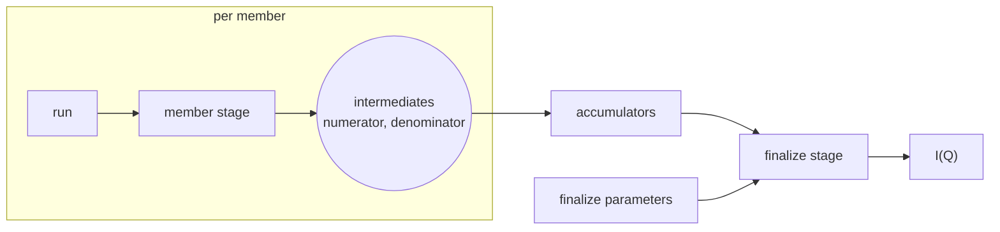

# Aggregation over runs

This document covers how results from several runs are combined into one: a sum over runs in SANS, a stitch over angles in reflectometry, a series that grows while the experiment is running.
It is the detail behind ["Aggregation over runs" in architecture.md](architecture.md#aggregation-over-runs).

## The shape of a sum over runs

The ESS workflows combine runs in different places, but the additive cases share one shape.

| Workflow | What it combines | How |
|---|---|---|
| ess.sans | numerator and denominator of I(Q), over runs | events by concatenation, dense data by summation, normalisation once after the merge |
| ess.reflectometry | runs at the same angle; then angles | events by concatenation; then a global fit of scale factors over all curves, which is not additive |
| ess.powder | nothing yet | normalises per run, upstream of where a sum would go |
| ess.bifrost | angle groups inside one run | events grouped by rotation and concatenated |



A stage per member computes one or more intermediates.
The intermediates of all members are accumulated.
A finalize stage turns the accumulated values into the outputs.
Normalisation sits in the finalize stage, so there are usually two intermediates, a numerator and a denominator.
Dimensionality and event mode do not change the shape: a 4D volume adds like a curve, and concatenation is accumulation for binned data.

sciline's `Aggregation` (scipp/sciline#245) is this shape as an object: a contribute stage, one accumulator per intermediate, which sciline calls an accumulation key, and a finalize stage.
An `Aggregation` holds nothing between calls, so whoever loops over the members holds the accumulators.

## Inside one run, or across run records

An aggregation appears in one of two places, never half in each.

**Inside one run**, the workflow code runs `Aggregation.compute` itself, and the framework sees an ordinary spec.
This is for members the framework has no records for: angle groups inside a Bifrost run, chunks of an NMX file.

**Across run records**, each member has a run record of its own.
Members then run in parallel, a series grows by one member without reducing the others again, and a member can be removed.
This is for runs, and the rest of this document is about it.

## Member stages and a finalize stage

An aggregation needs no spec of its own.
The spec exposes the values that add as intermediates ([workflow-contract.md](workflow-contract.md#changes-to-the-spec-of-scippess690)), and the binding gives an accumulator for each.
A client writes a template that sets every parameter but the member's, and cuts two stages from it:

```python
normalize = Template(spec=NORMALIZE, params={'floor': 1.5, 'scale': 2.0})   # 'run' left unset

member = normalize.cut(blanks=('run',), outputs=('numerator', 'denominator'), name='members')
members = [client.run(member, {'run': r}) for r in runs]                  # dispatched in parallel

finalize = normalize.cut(blanks=('numerator', 'denominator'), outputs=('normalized',), name='total')
total = client.run(finalize, {
    name: Accumulate(accumulate=[m.ref(name) for m in members])
    for name in ('numerator', 'denominator')
})
client.output(total, 'normalized')
```

This is `sciline.Aggregation(pipeline, members=[RunFile])`: `member` is its contribute stage and `finalize` its finalize stage.
Outside a session each `client.run` is dispatched and returns at once, and the finalize run record waits for its members as [pending outputs](records.md#scheduling-pending-outputs-as-inputs).

**`Accumulate` is a supplied intermediate whose value is the accumulation of the outputs it lists.**
The binding resolves it with the accumulator the author gave for that intermediate, in the order listed.
The framework never adds arrays, never chooses between summation and concatenation, and never places normalisation.

Whether an intermediate holds events or a histogram is the author's choice.
Events keep the binning a parameter of the finalize stage, and cost memory and disk.
A histogram fixes the bins in the member stage, and is small.
The framework does not see the difference.

A parameter that only the finalize stage reads, and that a person wants to change after the members ran, is varied by the finalize stage:

```python
normalize = Template(spec=NORMALIZE, params={'floor': 1.5})           # 'run' and 'scale' not given
finalize = normalize.cut(blanks=('numerator', 'denominator', 'scale'), outputs=('normalized',))
```

The members' records hold the default of `scale`, filled at submit, which their stage does not read.
The finalize varies `scale`, so the agreement below does not compare it.

## Members agree on their parameters

Members and finalize cut from one template share every parameter they do not vary: the same masks, the same direct beam, the same wavelength bins.
**The backend refuses an intermediate from a run record of the same spec that disagrees with the consuming request on a parameter both set in `params` and neither varies,** and names the first parameter that disagrees: "made with floor=1.5, this request sets floor=0.0".
Both sides are compared as recorded, defaults filled, so a member that omitted a default agrees with a finalize that gives it.
A parameter either side varies, such as the members' `run`, is not compared: members differ in it by intent.
The check is made at validation and without workflow code.

A correction that changes a shared parameter, such as better masks, gives another workflow ID, and all members run again with it.
sciline does the same: a changed pipeline parameter means a new `Aggregation`.

A workflow with two member tables, such as sample runs and background runs in ess.sans, is two member stages cut from one template and one finalize stage:

```python
sans = Template(spec=SANS_WITH_BACKGROUND,
                params={'masks': masks, 'direct_beam': db, 'q_bins': 100})
sample = sans.cut(blanks=('sample_run',), outputs=('sample_numerator', 'sample_denominator'))
background = sans.cut(blanks=('background_run',),
                      outputs=('background_numerator', 'background_denominator'))
finalize = sans.cut(blanks=('sample_numerator', 'sample_denominator',
                            'background_numerator', 'background_denominator'),
                    outputs=('iofq',))
```

## A growing series

A series grows by one run per arrival, and each arrival submits a finalize.
**Every finalize lists every current member of its series** in its `Accumulate`, so the sum a finalize run record stands for is read off its request alone.
The **current members** of a series are a query: the latest run record per member key under the label, leaving out failed, cancelled, and excluded ones.
`apply` makes the finalize request from them (`ess.apps.batch._finalize`).

- **A correction is never counted twice.**
  A corrected member has a new run record, and the next finalize lists it in place of the old one.
  A member reprocessed under a new rule version is likewise current only through its new record, and an excluded or failed member is not current at all.
  Removing a member is therefore never a subtraction.
- **Two arrivals close together cannot lose a member.**
  Each finalize lists every current member, those submitted in the same group included.
- **A finalize is a complete run record.**
  Its references name member run records, which name the files.
  If disk copies of intermediates were evicted, a recompute runs the member run records again.
- **The framework asks nothing of an accumulator beyond `push` and `value`.**
  sciline's `Accumulator` contract asks for associativity, but nothing here relies on it, because no finalize accumulates a value that another finalize accumulated.

The cost is reading: the finalize of the k-th arrival reads k values per intermediate.
A session pushes only the new member into the accumulator it holds ([In a session](#in-a-session)).
Without a session, a runner may keep the accumulated value of an earlier finalize as a cache under the same rule: when a finalize's list begins with the list that value was accumulated from, only the rest is read.
The request stays the same, so such a cache is invisible in the records, like every other cache.
It is not built.
Whether a throwaway runner reads the members of a series of 4D intermediates fast enough is a measurement ([open-issues.md](open-issues.md#open-questions)).

## Combinations that are not accumulations

A combination that is not an accumulation, such as reflectometry's stitch over angles with its global fit of scale factors, is a spec whose parameter is a list of references to per-angle curves (`ess.apps.amor.COMBINE`), and a tomographic reconstruction would be another.
Recomputing it over all members on every arrival is affordable, because such inputs are small.
A rule's `Series` accumulates only, and how a rule submits such a spec is an [open question](open-issues.md#open-questions).

## In a session

In a session an aggregation needs nothing of its own.
Sessions and stages are explained in [stages.md](stages.md).

- **Member run requests name one stage**, with the same workflow ID, the same varied parameter, and the same outputs, so the session builds it once.
  What the members share, such as a direct beam, is computed once.
- **The session holds one accumulator per workflow ID and intermediate**, with the list of outputs pushed so far.
  A finalize whose `Accumulate` lists every member so far plus a new one pushes only the new one.
- **A corrected or removed member starts a fresh accumulator**, because the request's list does not begin with what was pushed.
  Nothing is subtracted.
- **A finalize call that changes only a finalize parameter it varies** reuses the held finalize stage and the held accumulators.

A series that grows in a session lists every current member in every finalize, as a rule does:

```python
members = []

def add_run(run):
    members.append(client.run(member, {'run': run}))
    return client.run(finalize, {
        name: Accumulate(accumulate=[m.ref(name) for m in members])
        for name in ('numerator', 'denominator')
    })
```

## The fold

The **fold** is an optional addition for a series that arrives faster than its members can be read.
A long-lived runner holds the accumulators of one series and serves each finalize under the prefix rule of a session's held accumulator, so a finalize that lists one more member reads only that member.
It may also write a finalize run record only every n arrivals or when the series goes quiet.
Each finalize request lists every current member, so what the runner holds is recomputable from the request, and held state remains a cache.
A fold's records carry the `reused` flag, so publication recomputes them from their members.
The fold needs a runner that is addressed by its series, which does not exist yet, and nothing requires it before such a series appears.
[stages.md](stages.md#kept-runners) discusses kept runners.

## How this maps onto sciline

sciline composes stages and accumulators in one process, with values in memory.
The framework records each call as a run record, with values as outputs of run records.

| sciline | Framework |
|---|---|
| `Pipeline` with parameters set | spec and the parameters not varied of a run request, named by its workflow ID |
| `Stage(pipeline, inputs, outputs)` | a template whose blanks are the stage inputs |
| `Stage.compute` | a run record |
| `Aggregation.contribute_stage` | a member stage, varying the member's parameters, with the exposed intermediates as outputs |
| accumulators | the binding's accumulators, which resolve `Accumulate` |
| `Aggregation.finalize_stage` | a finalize stage, supplied the intermediates, with the results as outputs |
| member table | the batch table that `apply` takes |
| `Aggregation.compute(table)` | a group: one member run request per row, one finalize run request |
| accumulators held by a loop | accumulators held by a session; without one, a finalize reads every member |

One structure serves adding a run in a notebook, a rule's growing series, a batch summed at once, and a parallel reduction of five hundred runs.
They differ in where the intermediates come from and whether a process holds the accumulators between finalizes.

## Alternatives considered

**The framework sums arrays itself.**
It would import scipp semantics, decide between summation and concatenation, and still could not place normalisation.

**Contribute and combine specs with `carry`.**
Every pipeline that aggregates is published as two or three specs cut at the values that add: a contribute spec whose one output is the member's contribution, and a combine spec over a list of references to contributions.
A `carry` declaration on the combine spec says that its combined contribution may be passed back into that list.
Members must agree on shared parameters, which only the adapter knows, so it writes them into every contribution and the combine refuses a mismatch after loading.
The associativity promise sits on the spec although it is a property of the code, and a rule with a series holds two templates.

**An aggregation spec.**
A spec whose signature is `Aggregation.compute(table)`, expanded by the backend into member and finalize records.
It needs no `carry` and no agreement check either, but adds a second kind of spec and records created on behalf of a request, and it does nothing for stages in general.

**Members and finalize share a stored workflow record.**
A record of the values given, without defaults, which members and finalize must share by ID.
A member that omitted a default and a finalize that gives it then cannot be accumulated together, although they ran with the same values, and a recompute applies whatever the spec's defaults are at that time.

**Finalizes that accumulate onto earlier finalizes.**
A finalize also outputs the accumulated values, and the next finalize lists them with the members the previous one does not cover.
The k-th arrival then reads two values per intermediate instead of k.
What a finalize run record sums is then found only by walking back through earlier finalizes, a correction is detected only by comparing the records a previous finalize covers with the current members, and every accumulator must be associative.
A cache in the runner gives the same saving and leaves the request as it is.

## Costs

- Authors must expose the intermediates that add, each with a format, and give an accumulator for each.
- Authors must place normalisation after those intermediates. ess.sans does, ess.powder does not yet.
- Intermediates are stored outputs in shared mode, and often large. Without a session, the finalize of the k-th arrival reads k of them per intermediate.
- In a rule's series, a member made with a value other than the template's, because a lookup or a pinned value set a field beyond the blanks, cannot be accumulated ([open-issues.md](open-issues.md#open-questions)).
- A correction to a shared parameter runs every member again.
- The agreement rule does not compare a parameter either side varies, so a value a member varies is not checked against a value the finalize sets.
- An intermediate to accumulate must be storable, because it is an output of each member. essreflectometry accumulates a list of ORSO entries beside its events, which the author must convert.
- A member stage in a throwaway process computes again what all members share.
