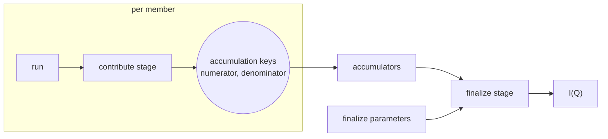

# Aggregation over runs

This document covers how results from several runs are combined into one: a sum over runs in SANS, a stitch over angles in reflectometry, a series that grows while the experiment is running.
It is the detail behind ["Aggregation over runs" in architecture.md](architecture.md#aggregation-over-runs).

## The shape of a sum over runs

The ESS workflows combine runs in different places, but the additive cases share one shape.

| Workflow | What it combines | How |
|---|---|---|
| ess.sans | numerator and denominator of I(Q), over runs | events by concatenation, dense data by summation, normalisation once after the merge |
| ess.reflectometry | runs at the same angle; then angles | events by concatenation; then a global fit of scale factors over all curves, which is not additive |
| ess.powder | nothing yet | normalises per run, upstream of where a sum would go |
| ess.bifrost | angle groups inside one run | events grouped by rotation and concatenated |



A stage per member produces an intermediate at one or more **accumulation keys**.
The intermediates of all members are added.
A finalize stage turns the sum into the outputs.
Normalisation sits in the finalize stage, so the intermediate usually has two parts, a numerator and a denominator.
A member's **contribution** is its values at the accumulation keys.
Dimensionality and event mode do not change the shape: a 4D volume adds like a curve, and concatenation is addition for binned data.

sciline's `Aggregation` (scipp/sciline#245) is this shape as an object: a contribute stage, one accumulator per accumulation key, and a finalize stage.
The parameters that differ from member to member are its member keys.
This documentation calls them **member parameters**, because a member key here is the label of a batch member.
An `Aggregation` holds nothing between calls, so whoever loops over the members holds the contributions.

## Inside one callable, or across records

An aggregation appears in one of two places, never half in each.

**Inside one callable**, the callable runs `Aggregation.compute` itself, and the framework sees an ordinary spec.
This is for members the framework has no records for: angle groups inside a Bifrost run, chunks of an NMX file.

**Across records**, each member has a record of its own.
Members then run in parallel, a series grows by one member without reducing the others again, and a member can be removed.
This is for runs, and the rest of this document is about it.

## Two plain specs

[A spec is the signature of one callable, and a record is one call of it](workflow-contract.md#the-callable).
An `Aggregation` is not a callable but a composition of two, so it has no spec.
A workflow package publishes two specs cut from one pipeline, and optionally the pipeline's own spec for a single run.
From `ess.apps.examples`:

```python
class ContributeParams(BaseModel):      # what the contribute stage reads
    run: OpaqueFile
    floor: float = 0.0

class ContributeOutputs(BaseModel):
    contribution: Array()               # a scipp DataGroup, one entry per accumulation key

class CombineParams(BaseModel):
    contributions: list[Array()]        # references to contributions
    scale: float = 1.0                  # what only the finalize stage reads

class CombineOutputs(BaseModel):
    contribution: Array()               # the combined contribution
    normalized: Array(ArraySpec(dims=('x',)))

NORMALIZE_CONTRIBUTE = WorkflowSpec(name='normalize-contribute', version=1,
                                    params=ContributeParams, outputs=ContributeOutputs)
NORMALIZE_COMBINE = WorkflowSpec(name='normalize-combine', version=1,
                                 params=CombineParams, outputs=CombineOutputs,
                                 chain={'contributions': 'contribution'})
```

- The **contribute spec** has one output, the contribution, so that one reference names everything a member adds.
  What it holds is the author's choice: a numerator and a denominator, monitor spectra, proton charge.
- The **combine spec** takes a collection of references to contributions and the parameters that only the finalize stage reads.
  Its callable adds the contributions and runs the finalize stage on the sum.

Both are plain specs.
A contribute request and a combine request are validated, shown in a form, saved as templates, recorded, and recomputed like any other request.
The framework's **aggregation** is a group of requests: one member request per row of a member table, and one combine request that references their contributions.
The combine request waits for its members as [pending outputs](records.md#scheduling-pending-outputs-as-inputs), and the scheduler needs nothing else.

```python
members = {f'm{i}': client.request(NORMALIZE_CONTRIBUTE, {'run': run, 'floor': 1.5})
           for i, run in enumerate(runs)}
combine = client.request(NORMALIZE_COMBINE, {
    'contributions': [OutputRef(record=f'@{name}', output='contribution') for name in members],
    'scale': 2.0,
})
group = client.submit_group({**members, 'combine': combine})
```

Whether the contribution holds events or a histogram is the author's choice at the accumulation key.
Events keep the binning a parameter of the combine spec, and cost memory and disk.
A histogram fixes the bins in the contribute spec, and is small.
The framework does not see the difference.
It never adds arrays, never chooses between summation and concatenation, and never places normalisation.

## The adapter serves both specs from one pipeline

`ess.apps.aggregation.Aggregation` takes the pipeline, the two specs, the member parameters, the accumulation keys, and the package's combine function, and returns one callable per spec:

```python
Aggregation(
    sciline.Pipeline([load_counts, numerator, denominator, normalized]),
    contribute=NORMALIZE_CONTRIBUTE, combine=NORMALIZE_COMBINE, run=NORMALIZE,
    keys={'run': RunFile, 'floor': Floor, 'scale': Scale},
    resolve={'run': 'path'},
    targets={'normalized': Normalized},
    members=['run'],
    accumulation_keys={'numerator': Numerator, 'denominator': Denominator},
    accumulate=add,
)
```

**The adapter checks the specs against the graph when it is built.**
The parameters of the contribute spec must be those the contribute stage reads.
The literal parameters of the combine spec must be those only the finalize stage reads.
An accumulation key that does not depend on the members is an error.
A wrong spec is then an error at construction, not a wrong result.

**Members must share every contribute parameter that is not a member parameter**: the same masks, the same direct beam, the same wavelength bins.
Only the adapter knows which parameters are member parameters, so the backend cannot make this check.
The adapter writes the values of the shared parameters into the contribution, as one reserved entry beside the accumulation keys.
The combine callable refuses contributions that disagree, after loading them and before computing anything.
The combined contribution carries the same entry, so the check holds along a chain without walking it.

A parameter that both stages read reaches the finalize stage the same way.
ess.sans has one, the uncertainty broadcast mode.
It is a field of the contribute spec only, the finalize stage takes its value from the contribution, and the combine spec cannot set it differently from the members.

The adapter imports sciline, so it belongs in ess.reduce beside the spec module.
It stays in the skeleton until `ess.reduce.spec` of scipp/ess#690 has merged.

## The `chain` declaration

A series that grows by one run per arrival should not read all earlier contributions each time.
`chain={'contributions': 'contribution'}` on the combine spec says that the output `contribution` of one run may be passed as an element of the parameter `contributions` of a later run, where it stands for everything it was combined from:

```python
combine([combine([a, b]), c]) == combine([a, b, c])
```

The author may declare this only if the combination does not depend on how the elements are grouped or ordered.
The framework cannot check that property.
The test helper `ess.apps.testing.assert_combine_is_associative` does: it runs contribute and combine over a list of members in two groupings and one permutation, passes a combined value in again, and compares.
Every combine spec that declares `chain` runs it.
The spec itself validates that the parameter is a collection of references, that the output exists, and that their formats match.

`chain` is the only declaration an aggregation needs.
Its one kind of reader is whatever builds the combine request of a series, which is `apply` and the trigger loop ([rules.md](rules.md)), and that reader cannot import workflow code.
A component that ignores the declaration still validates, runs, records, and recomputes the spec correctly.
It loses an optimisation only.

### When chaining is valid

The **current members** of a series are a query: the latest record per member key under the label, leaving out failed, cancelled, and excluded ones.
A combine over the contributions of all current members is always correct.
A **chained** combine references the previous combine's contribution and every current member that the previous combine does not cover.
`apply` decides between the two (`ess.apps.batch._combine`):

```python
def contributions_for_next_combine(series):
    current = current_members(series)                  # records
    previous = latest_completed_combine(series)
    if spec.chain and previous and covers(previous) <= current:
        return [previous.contribution] + [m.contribution for m in current - covers(previous)]
    return [m.contribution for m in current]

def covers(combine):                                   # follow the chained parameter back
    return union(covers(producer(ref)) if produced_by_combine_spec(ref) else {producer(ref)}
                 for ref in combine.params['contributions'])
```

- **The comparison is between records, not member keys.**
  A corrected member has a new record, so the previous combine covers a record that is no longer current.
  The check fails, and the next combine runs over all current members.
  The same happens when a member is excluded or reprocessed under a new rule version.
  Removing a member is therefore never a subtraction.
- **A failed or cancelled combine is never chained onto.**
  Otherwise one transient failure would end the series.
- **Two arrivals close together cannot lose a member.**
  The later combine references every current member that the previous combine does not cover, not only the newest.
- **A chained element is recognised without a rule.**
  It is an output of a run of the combine spec itself, through the output that `chain` names.
- **The walk reads metadata only**, one record per combine of the chain.
  The k-th arrival costs k record reads and two contribution reads.
- **A chained combine is a complete record.**
  Its references resolve to records that name the files, and a recompute walks the chain back to the members.
  If disk copies of contributions were evicted, the contribute requests run again.

A superseded combine's contribution is needed only by the combine that superseded it, which has already run.
The data store evicts outputs of superseded records first, and that costs nothing until a recompute walks the chain.
Chaining through disk is enough for automatic reduction: even a 4D contribution of a few gigabytes is read and written once per arrival, and arrivals are minutes apart.

## Combines that are not additive

A combine that is not additive is the same shape without `chain`.
Reflectometry's stitch is a combine spec with a collection parameter of per-angle curves, and a tomographic reconstruction would be another.
A rule combines over all members on every arrival, which is affordable because such inputs are small.
A rule's combine clause has one form for both cases.

A workflow with two member tables, such as sample runs and background runs in ess.sans, has two contribute specs and one combine spec that chains two parameters, each with its own output.

## In a session

In a session an aggregation needs nothing of its own.
Sessions and stages are explained in [stages.md](stages.md).

- **Contributions are outputs, and a session holds outputs in memory.**
  A chained combine gets the previous combined contribution and the new member as objects, and combines two values.
  A push into a held accumulator would compute the same, so the session holds no accumulators.
- **Contribute requests that differ only in the run are routed to a stage whose stage input is the run.**
  What the members share, such as a direct beam, is computed once.
- **A combine request that changes only a finalize parameter is routed to a stage of the combine spec with the contributions fixed.**
  The adapter combines the contributions once, sets the sum at the accumulation keys, and builds a `sciline.Stage` from the finalize parameter.
- **Successive combines of a growing series differ only in their contributions.**
  The session asks for a stage with `contributions` as stage input, and the adapter makes the accumulation keys the inputs of the `sciline.Stage`.

A run reduced through the single-run spec leaves no contribution.
A person who expects to add runs reduces the first one as a series of one: a contribute request and a combine request.

## The fold

The **fold** is an optional addition for a series that arrives faster than its contribution can be read and written.
A long-lived runner holds the latest combined contribution of one series, chains in memory, and writes a combine record every n arrivals or when the series goes quiet.
Between records, what it holds is recomputable from the last record and the members since, so held state remains a cache.
A fold's records carry the `reused` flag, so publication recomputes them along the chain.
The fold needs a runner that is addressed by its series, which does not exist yet, and nothing requires it before such a series appears.
[stateless.md](stateless.md) discusses kept runners.

## How this maps onto sciline

sciline composes stages and accumulators in one process, with values in memory.
The framework composes specs across processes, with values as outputs of records.

| sciline | Framework |
|---|---|
| `Pipeline` with parameters set, `compute(targets)` | one spec, one request, one record |
| `Stage` whose inputs are parameters, kept between calls | the same spec; the session holds the stage |
| `Stage` whose input is an intermediate result | a second spec that takes an output of the first |
| `Aggregation.contribute_stage` | the contribute spec |
| accumulators and `finalize_stage` | the combine spec |
| member table | the batch table that `apply` takes |
| `Aggregation.compute(table)` | a group: one member request per row, one combine request |
| accumulators held by a loop | the previous combined contribution, passed into the next combine |

One structure serves adding a run in a notebook, a rule's growing series, a batch summed at once, and a parallel reduction of five hundred runs.
They differ in where the contributions come from and how often the combined contribution is written as a record.

## Alternatives considered

**The framework sums arrays itself.**
It would import scipp semantics, decide between summation and concatenation, and still could not place normalisation.

**One spec with three entry points.**
A spec marks one output as its contribution and lists the parameters that finalize reads, and a request says whether it runs the whole workflow, contribute, or combine.
One spec then stands for three callables with three signatures, two of them derived.
Validation, forms, templates, the runner, and rules each branch on the kind of request.
A combine request carries its contributions beside its parameters instead of as a parameter.
Every output but the contribution must be optional.
A workflow with two member tables cannot be declared.

**A spec for the pipeline, and a second declaration for the operation on top.**
A stored object beside the spec mirrors the constructor of `Aggregation`.
The declaration of which parameters finalize reads only moves, because field names cannot give a property of the graph.
Every component that reads a record's identity gets a three-part address: workflow, operation, entry point.
ADR 0001 of scipp/ess#690 decided the opposite: a slice of a pipeline with its own parameter set is a workflow with its own spec.

**Three specs: contribute, combine, finalize.**
This mirrors sciline exactly.
The middle spec has no parameters and no workflow code.
Its benefit is that changing a finalize parameter does not write the combined contribution again.
An author who needs that can publish a finalize-only spec as a further cut.

**No `chain`: always combine over all members.**
Correct, and simpler.
A series of k members then reads k contributions per arrival instead of two, which is too much for event-mode contributions of gigabytes.

**`chain` as an annotation on the parameter.**
It states a property of the callable that relates a parameter to an output, so it belongs on the spec and not on one of its fields.

**`chain` on the rule instead of the spec.**
The person who writes a rule cannot know whether a combine is additive, and a wrong answer gives a wrong number without an error.

## Costs

- Up to three specs per pipeline, versioned together by convention of the adapter. A UI that lists workflows shows the two building blocks beside the whole reduction.
- A rule with a series holds two templates, one for the member and one for the combine.
- Authors must place normalisation after the accumulation keys. ess.sans does, ess.powder does not yet.
- Contributions are stored outputs in shared mode, and often large. A chained series of k arrivals writes k combined contributions.
- Changing a finalize parameter on a combined result, outside a session, is a combine request over the one previous contribution, and writes that contribution again.
- The check that members share their parameters runs in the combine, not at validation.
- A value at an accumulation key must be storable in a scipp data group. essreflectometry accumulates a list of ORSO entries beside its events, which the author must convert.
- The contribution mixes dimensions and types, so its spec can declare a format but no `ArraySpec`.
- A contribute request in a throwaway process computes again what all members share.
