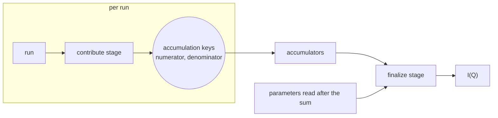

# Aggregation over runs

This document covers how results from several runs are combined into one: a sum over runs in SANS, a stitch over angles in reflectometry, a series that grows while the experiment is running.
It is the detail behind ["Aggregation over runs" in architecture.md](architecture.md#aggregation-over-runs).

## The shape of a sum over runs

The ESS workflows combine runs in different places.

| Workflow | What it combines | How |
|---|---|---|
| ess.sans | numerator and denominator of I(Q), over runs | events by concatenation, dense data by summation, normalisation once after the merge |
| ess.reflectometry | runs at the same angle; then angles | events by concatenation; then a global fit of scale factors over all curves, which is not additive |
| ess.powder | nothing | normalises each run by its own monitor |
| ess.bifrost | angle groups inside one run | events grouped by rotation and concatenated |


```mermaid
flowchart LR
    subgraph member["per run"]
        run[run] --> contribute[contribute stage] --> keys(("accumulation keys<br/>numerator, denominator"))
    end
    keys --> add[accumulators] --> finalize[finalize stage] --> result["I(Q)"]
    params[parameters read after the sum] --> finalize
```

A contribute stage per run computes one or more values.
The values of all runs are accumulated.
A finalize stage turns the accumulated values into the outputs.
What a contribution is, normalised or not, is the author's choice.
ess.sans contributes a numerator and a denominator and normalises in the finalize stage.
Dimensionality and event mode do not change the shape: a 4D volume adds like a curve, and concatenation is accumulation for binned data.

sciline's `Aggregation` (scipp/sciline#245) is this shape as an object: a contribute stage, one accumulator per **accumulation key**, and a finalize stage.
Its members are the rows of a **member table**, whose columns are the member keys.
The package builds the aggregation, and the binding wraps it, so a workflow author uses the model of sciline and nothing is solved twice.

## A sum is one run over a list of runs

A sum over runs is one run request whose run parameter is a list.
The spec says that the sum is part of the signature:

```python
class NormalizeParams(BaseModel):
    runs: list[OpaqueFile] = Field(min_length=1)
    floor: float = 0.0
    scale: float = 1.0
```

```python
runs = [dataset_ref(instrument='dream', run=n) for n in (1, 2, 3)]
total = client.run(NORMALIZE, {'runs': runs, 'floor': 1.5, 'scale': 2.0})
total.request.params['runs']        # the three runs: the record names what it sums
```

The backend validates the request against the whole params model, like any other, so an empty list is refused at submit.

The binding gives, for each list parameter, the package's function that builds the aggregation:

```python
def normalize_aggregation(pipeline: sciline.Pipeline) -> sciline.Aggregation:  # the package's
    return sciline.Aggregation(
        pipeline, members=[RunFile], accumulators=ACCUMULATORS, outputs=[Normalized]
    )

PipelineAdapter(
    normalize_pipeline(),
    keys={'runs': RunFile, 'floor': Floor, 'scale': Scale},
    resolve={'runs': 'path'},
    targets={'normalized': Normalized, 'numerator': Numerator, 'denominator': Denominator},
    aggregations={'runs': normalize_aggregation},
)
```

The binding takes a function rather than an aggregation, because an aggregation is a snapshot of the pipeline's parameters, and the binding sets them per request.
For each list parameter that the requested outputs need, the adapter builds the aggregation, contributes each run through it, and pushes into its accumulators:

```python
aggregation = normalize_aggregation(pipeline)      # every parameter the request does not vary is set
acc = aggregation.accumulators()
for run in runs:
    for key, value in aggregation.contribute({RunFile: run}).items():
        acc[key].push(value)
finalize.compute({key: a.value for key, a in acc.items()} | varied_read_after)
```

`finalize` is one stage of the binding's own, from the accumulation keys of every list parameter, plus the varied parameters read after them, to the requested outputs.
The aggregation's own finalize stage is not used, because the requested outputs and the varied parameters change from request to request ([workflow-contract.md](workflow-contract.md#the-sciline-adapter)).
A varied parameter that the contributions read is set on the pipeline, so each new value builds a new aggregation.
An output that needs each run separately, and not only what the runs accumulate to, is refused when the stage is built.
An example is the counts of one run in a sum.

The framework never adds arrays, never chooses between summation and concatenation, and knows nothing about normalisation.
The accumulation keys need not be exposed in the spec.
They never leave the run, so they need no format, and anything the accumulator can combine works, such as essreflectometry's lists of ORSO entries.
An intermediate the spec does expose, such as `numerator` above, is over a sum its accumulated value.

Whether an accumulation key holds events or a histogram is the author's choice.
Events keep the binning a parameter read after the sum, and cost memory.
A histogram fixes the bins in the contribute stage, and is small.
The framework does not see the difference.

### A value per run

A value that differs per run is a second column of the member table.
The list then holds rows, models whose fields are the columns, as the skeleton's `FLOORED` spec does:

```python
class FlooredRun(BaseModel):
    run: OpaqueFile
    floor: float = 0.0          # this run's own floor

class FlooredParams(BaseModel):
    runs: list[FlooredRun] = Field(min_length=1)
    scale: float = 1.0          # one value for the whole sum

PipelineAdapter(
    normalize_pipeline(),
    keys={'runs': {'run': RunFile, 'floor': Floor}, 'scale': Scale},
    resolve={'runs': 'path'},
    targets=...,
    aggregations={'runs': floored_aggregation},   # members=[RunFile, Floor]
)
```

The key of a list of rows maps each field of the row model to a member key, and these must be the aggregation's member keys.
A plain list of values is the table with one column.
A transmission run per sample run or a rotation offset per angle has the same form.

### Two lists

A workflow that sums sample runs and background runs separately has two list parameters, as the skeleton's `BACKGROUND` spec does:

```python
client.run(BACKGROUND, {'sample_runs': samples, 'background_runs': backgrounds})
```

Each list has its own aggregation, built without outputs, and the binding's one final stage reads the accumulation keys of both.
This is how sciline composes two aggregations that share a final stage.

## In a session

A template whose blank is the list names the stage a session holds ([stages.md](stages.md)):

```python
total = Template(spec=NORMALIZE, blanks=('runs',), name='sum')
first = client.run(total, {'runs': [r611, r612]})
added = client.run(total, {'runs': [r611, r612, r613]})    # contributes only r613
removed = client.run(total, {'runs': [r611, r613]})        # accumulates both again
```

The held stage keeps the accumulation over the runs it has seen.
A call whose list begins with those runs contributes only the rest.
Any other list, such as one without a run, is accumulated again from its first run.
Each record names every run it sums, and recomputing it needs nothing from the session.

A parameter varied over a sum reuses the sum when only the finalize stage reads it:

```python
tune = Template(spec=NORMALIZE, params={'runs': runs, 'floor': 1.5}, blanks=('scale',))
client.run(tune, {'scale': 2.0})     # normalisation reads scale: the sum is reused
tune = Template(spec=NORMALIZE, params={'runs': runs, 'scale': 2.0}, blanks=('floor',))
client.run(tune, {'floor': 0.0})     # each run's numerator reads floor: accumulated again
```

The binding decides which of the two applies, from the graph.
The caller only says what varies.

## A series under a rule

On each arrival a rule with a series submits one request whose dataset field lists every current run of the series ([rules.md](rules.md#series)).
Successive requests supersede each other, and the result a record stands for is read off its request alone.

- **A correction is never counted twice.**
  A run that arrives again is listed once, and an excluded run is not listed at all.
- **A run that cannot be read fails the whole series request, visibly.**
  The operator excludes the run, and `retry` submits the series without it.
- **Each run is filled from its own lookup entry**, into its own row when the list holds rows ([rules.md](rules.md#series)).

A rule runs each request in a throwaway process, so the request of the k-th arrival reduces all k runs.
A disk cache of contributions would remove that cost.
The binding knows its exact key, the values the contribute stage reads plus the run's identity and checksum, and the cache would be invisible in the records.
It is not built.

The **fold** is a long-lived runner that holds the stage of one series, as a session does, so a request with one more run contributes only that run.
It needs a runner addressed by its series, which does not exist yet ([stages.md](stages.md#kept-runners)).

## Reducing the runs of a sum on separate nodes

A sum inside one request runs in one process.
To spread the runs over nodes, the author splits the sum into two specs, and the client composes them over references.
The skeleton's `CONTRIBUTE` and `COMBINE` are built from the one aggregation that `NORMALIZE` wraps:

```python
def contribute(params, inputs):     # CONTRIBUTE: one run -> numerator and denominator
    pipeline = normalize_pipeline()
    pipeline[Floor] = params.floor
    part = normalize_aggregation(pipeline).contribute({RunFile: inputs.path(params.run)})
    return {'numerator': part[Numerator], 'denominator': part[Denominator]}

def combine(params, inputs):        # COMBINE: rows of references to contributions -> result
    pipeline = normalize_pipeline()
    pipeline[Scale] = params.scale
    aggregation = normalize_aggregation(pipeline)
    parts = [{Numerator: inputs.array(p.numerator), Denominator: inputs.array(p.denominator)}
             for p in params.parts]
    return {'normalized': aggregation.finalize(aggregation.combine(parts))[Normalized]}
```

```python
member = Template(spec=CONTRIBUTE, params={'floor': 1.5}, blanks=('run',))
parts = [client.run(member, {'run': r}) for r in runs]    # independent requests
total = client.run(COMBINE, {
    'parts': [{'numerator': p.ref('numerator'), 'denominator': p.ref('denominator')}
              for p in parts],
    'scale': 2.0,
})
```

The result equals the one request over the list.
Each record describes only its own computation, and the parts are one reference away.
The combine waits for the parts as [pending outputs](records.md#scheduling-pending-outputs-as-inputs).
The costs are in [Costs](#costs).
A rule cannot drive this, because a series fills a dataset field with runs, not with references to the records of another rule.

## Combinations that are not accumulations

What the workflow does with a list is the workflow's business, so a sum and a stitch look the same to the framework.
In `ess.apps.amor`, reflectometry's stitch over angles, with its global fit of scale factors, is a spec whose parameter is a dict of references to per-angle curves, keyed by rotation (`COMBINE`).
Under a rule it needs a spec over a list of runs, which `ess.apps.amor` does not have yet.
Recomputing a stitch over all angles on every arrival is affordable, because its inputs are small.

## How this maps onto sciline

| sciline | Framework |
|---|---|
| `Pipeline` with parameters set | a run request's spec and `params` |
| `Stage(pipeline, inputs, outputs)` | a template whose blanks are the stage inputs, held by a session |
| `Stage.compute` | a run record |
| `Aggregation(pipeline, members=..., accumulators=...)` | built by the package, wrapped by the binding for a list parameter |
| member table | a list parameter; a list of rows for several member keys |
| two aggregations sharing a final stage | two list parameters |
| `Aggregation.compute(table)` | one run request whose list parameter holds the members |
| `contribute`, then `combine` and `finalize` | a contribute spec and a combine spec, composed over references |
| accumulators held by a loop | a stage over the list, held by a session |

## Alternatives considered

**The framework sums arrays itself.**
It would import scipp semantics and decide between summation and concatenation, which is each workflow's choice.

**A member record per run and a finalize record over their intermediates.**
Each run has a record of the stage from the run to the numerator and denominator, and a finalize record supplies the accumulated intermediates as a reference form of its own, `Accumulate`, to the finalize stage.
Runs reduce in parallel across processes and a series reads only the new member.
But pieces must fit together, and checking that needs to know which parameters each piece reads, which only the workflow code knows.
Without the graph the backend refuses a member of a sum with two run lists, because the member leaves the other list unset.
A request cut at an intermediate is validated only when it runs.
A value in `params` means one of three things: the run read it, the cut made it irrelevant, or an agreement check guarantees that the member records read it.
The agreement check skips every parameter that either side varies, so the names a caller varies decide correctness.

**A summary of the graph in the spec.**
The spec lists, per output, the parameters it reads, generated by the binding and checked against the pipeline, so the backend can check that the pieces of a sum fit.
It puts a derived property of the code into a document meant to be written by hand and read without code.

**Contribute and combine specs with `carry`.**
Every pipeline that aggregates is published as two or three specs cut at the values that add, and a `carry` declaration on the combine spec says that its combined output may be passed back into its list.
The adapter writes the member parameters into every contribution so the combine can refuse a mismatch, and the associativity promise sits on the spec although it is a property of the code.

**An aggregation spec.**
A spec whose signature is `Aggregation.compute(table)`, expanded by the backend into member and finalize records.
It adds a second kind of spec and records created on behalf of a request.

**Series requests that accumulate onto the previous request's result.**
A series request names the previous total and the new run, so the k-th arrival reads two values instead of k runs.
What a record sums is then found only by walking back through earlier records, a correction is detected only by comparing lists, and every accumulator must be associative.
A cache of contributions gives the same saving and leaves the request as it is.

## Costs

- The runs of one request over a list reduce in one process, one after another.
- A sum composed of two specs over references exposes its accumulation keys as outputs, with a format the store can write, and reaches the combine through disk.
  Nothing checks that the parts fit: a combine over parts reduced with different masks is accepted, and a parameter read on both sides is set twice and never compared.
  Making every part from one template makes them agree by construction.
- A series under a rule, without a session, reduces all k runs on the k-th arrival.
- One run that cannot be read fails the series request until someone excludes it.
- `sciline.Buffered` holds every contribution in memory.
- A correction to a parameter that the contribute stage reads reduces every run again, and builds a new aggregation, which computes again what the runs share.
- The binding wraps `sciline.Aggregation` only. A package driver for nested levels, such as runs times banks, has no place in the binding yet.
