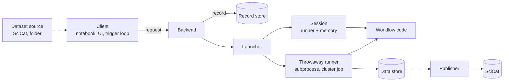

# Architecture of the ESS data-reduction framework

This document explains the design in about thirty minutes.
[README.md](README.md) is the five-minute version, and [scoping.md](scoping.md) states the goals.
Each section here ends with a pointer to a topic document, which holds the details, the rejected alternatives, and the costs.
A walking skeleton under `packages/essapps` implements the design in a single process.
Code examples in this document use the skeleton's API, and the [components table](#components) names the module for each part.
Terms are defined in the [glossary](glossary.md).

## The picture



A client submits a **run request**: which workflow, which parameter values, which input data.
The **backend** validates the request, writes it down as a **run record**, and asks a **launcher** to start a **runner**.
The runner calls the scientific workflow code and stores the outputs.
An output of one record can be an input of the next request.
Interactive work happens in a **session**, a process that keeps data in memory between runs.
Batch and automatic reduction make many requests from one stored **template**.
Publishing a result to SciCat is a separate, deliberate step.

## Requests, records, references

Two runs from a notebook, the second taking an output of the first:

```python
run = dataset_ref(instrument='dream', run=1)            # a dataset, named by identity
loaded = client.run(LOAD, {'run': run, 'scale': 2.0})
hist = client.run(HISTOGRAM, {'data': loaded.ref('data'), 'bins': 8})
```

The record of the second run, abridged:

```json
{
  "id": "3f9a1c0b77e2",
  "request": {
    "spec": {"name": "histogram", "version": 1},
    "params": {"data": {"record": "b41c22d90a61", "output": "data"}, "bins": 8},
    "instrument": "dream", "proposal": "p1", "submitter": "me"
  },
  "status": "completed",
  "resolved_params": {"data": {"record": "b41c22d90a61", "output": "data"}, "threshold": 0.0, "bins": 8},
  "package_versions": {"scipp": "26.8.0", "essdiffraction": "26.9.0"},
  "environment": "dream-2026-09",
  "stored_outputs": [{"record": "3f9a1c0b77e2", "output": "histogram"}]
}
```

A **run request** is everything needed to execute a workflow once.
It is plain JSON-serializable data, even when it never leaves a process.
It never names a session, a process, or a storage location.

A **run record** is the request plus what happened to it: status, timestamps, outputs, the parameter values after defaults were applied, package versions, and the environment.
The last three make "recompute this record" meaningful after a default changes or a package is upgraded.
A record is immutable once the run completes.

A **reference** is the only way a request names data. It has two forms:

| Form | Names | Example |
|---|---|---|
| Output reference | output X of record Y, optionally one element of a collection output | `{"record": "b41c…", "output": "data"}` |
| Dataset reference | data the framework did not compute: a SciCat dataset or a local file | `{"dataset": "pid:20.500.12269/abc"}`, `{"dataset": "run:dream/1"}` |

A reference names data by identity, never by where the bytes are.
Where a dataset's bytes are is asked of SciCat, or of the user's folder, when the run is dispatched.
Records keep references in reference form.
**Provenance** is therefore the graph obtained by following references from a result back to datasets, parameters, and software versions.
No separate provenance model exists.

Three rules complete the model:

- **Stand-ins resolve at submission.**
  A user may type a run number, a PID, or a path.
  The backend turns it into a reference before it writes the record, because provenance must not depend on a search that could give a different answer later.
- **A missing copy is reported, never silently recomputed.**
  Whether an output is usable is two questions: the record's status, and whether the data store holds a copy.
  Getting a dropped output back is an explicit `recompute`, which makes a new record linked to the old one.
- **Records are not deleted one at a time.**
  A proposal's records and stored outputs are dropped together after an analysis window.
  Stored bytes may be dropped earlier; the record stays.

Details: [records.md](records.md).

## Workflow code behind a spec

A **spec** declares a workflow's interface: name, version, a parameter model, an output model.
It is defined in scipp/ess#690, with the extensions listed in [workflow-contract.md](workflow-contract.md#changes-to-the-spec-of-scippess690).
The workflow itself is one stateless callable:

```python
class HistogramParams(BaseModel):
    data: Array(ArraySpec(dims=('x',), unit='counts'))   # holds a reference
    threshold: float = 0.0
    bins: int = Field(default=4, ge=1)

class HistogramOutputs(BaseModel):
    histogram: Array(ArraySpec(dims=('x',), unit='counts'))

HISTOGRAM = WorkflowSpec(name='histogram', version=1,
                         params=HistogramParams, outputs=HistogramOutputs)

def histogram(params: HistogramParams, inputs: Inputs) -> dict[str, Any]:
    data = inputs.array(params.data)       # or inputs.path(ref) for a NeXus file
    kept = drop_below(data, params.threshold)
    return {'histogram': kept.hist(x=params.bins)}
```

- **A spec is the signature of one callable, and a record is one call of it.**
  No request runs part of a spec, and no spec stands for several callables.
  A workflow that is run in parts is published as one spec per part.
- **Inputs are parameters.**
  A parameter that holds a reference is what this document calls an input.
  Outputs are declared in the same type vocabulary, so checking that an output may feed a parameter is a type check between two fields.
- **The callable asks for the form it wants**, a local path or a scipp object.
  Where the bytes come from is the runner's business: a session's memory, the data store, or a work directory.
  The callable cannot tell, so the same workflow code runs in a notebook session and in a cluster job.
- **The callable never writes files.**
  It returns objects by field name, and the runner validates and stores them.
- **The framework never imports sciline.**
  An adapter, which belongs in ess.reduce, turns a sciline pipeline into such a callable:

```python
PipelineAdapter(
    sciline.Pipeline([filter_data, histogram]),
    keys={'data': RawData, 'threshold': Threshold, 'bins': Bins},   # field -> sciline key
    resolve={'data': 'array'},                                      # form of each reference
    targets={'histogram': Histogram},                               # output field -> key
)
```

Installed packages provide specs and workflow factories through two entry-point groups.
The backend loads specs only, so it validates requests without importing workflow code.
Validation has three layers: JSON Schema, the pydantic parameter model, and runnability (references resolve, the submitter may read them, a launcher has the spec).

Details: [workflow-contract.md](workflow-contract.md).

## Where a run executes

Batch reduction, automatic reduction, and provenance need runs that describe their result completely and need no human present.
Interactive work needs the opposite: reruns in under a second over intermediates of several gigabytes, as in SANS.
The design pins "stateless" on the record and allows state in the process that executes it.

A run executes in one of two shapes:

| | In a session | In a throwaway process |
|---|---|---|
| Process | lives as long as its client wants | one run, then exit; subprocess or cluster job |
| Inputs | from the session's memory when it holds them | fetched from disk |
| Outputs | stay in memory; written only when asked | written to disk before completion is reported |
| Used for | interactive work | batch, automatic reduction, everything in shared mode |

A **session** belongs to one client and holds the outputs of its runs and the stages of its workflows (next section).
Two invariants keep it safe:

1. Session identity never appears in a record.
2. Everything a session holds can be recomputed from records.

A session is therefore a cache.
Losing one costs time and nothing else.
The second invariant holds for every value the system keeps in memory, which is what later lets a growing sum over runs be kept on disk or in memory interchangeably.
It holds because reduction here consumes datasets.
It would not hold for a live stream, which is esslivedata's problem and out of scope.

The **data store** is a registry of disk copies plus a disk tier, addressed by reference.
Each process also has a private memory cache.
The registry never learns about memory caches, so no cache-coherence protocol exists, and the backend never waits on a user's process.

The framework runs in two modes.
In **local mode**, client, backend, launcher, session, and data store are one Python process: a notebook.
In **shared mode**, the backend is a service for one instrument, every run is a throwaway process, and sessions come later.
The skeleton implements local mode, with a subprocess launcher as the throwaway shape.

Details: [records.md](records.md#where-runs-execute-and-where-data-lives).

## Interactive work

A person tuning a reduction moves one parameter at a time, and expects a plot to follow.
Each move is a new, complete request with its own record.
Three mechanisms make that fast and presentable.

**Stages make reruns cheap.**
A workflow may offer `stage(params, stage_inputs, inputs)`: a callable with the workflow's signature that accepts requests differing from `params` only in the fields named by `stage_inputs`.
It may hold everything those fields cannot affect, such as the loaded and coordinate-converted data.
The sciline adapter implements this with `sciline.Stage` (scipp/sciline#245).
The session holds the stages, not the workflow, and the session chooses the stage inputs: they are the fields in which a request differs from the previous request under its label.
A slider therefore names its own stage input, without any declaration by the workflow author.

```python
first = client.run(HISTOGRAM, {'data': data, 'bins': 2}, label='hist')
second = client.run(HISTOGRAM, {'data': data, 'bins': 8}, label='hist')   # differs in 'bins'
third = client.run(HISTOGRAM, {'data': data, 'bins': 16}, label='hist')   # served by the held stage
assert third.reused and client.latest('hist').id == third.id
```

**Labels keep hundreds of reruns from being what a person sees.**
A request may carry a **label**.
The latest record under a label supersedes the earlier ones, and each record links to the one it superseded.
An interactive tool owns a label, called its **slot**; comparing two variants side by side is two labels.
The same field serves batches and rules below.

**Views serve plots.**
A **view** is a small piece of an output for display: slicing, reduction over dimensions, downsampling.
It returns plain arrays, is served by the process that holds a copy, is not recorded, and is never an input of a run.
Dragging through slices of a 4D volume creates no records and never sends the volume to the frontend.
When a user wants to compute from a slice they found, the slice specification becomes a parameter of the next request.

Details: [stages.md](stages.md).

## Chaining

Requests submitted together may reference each other's outputs before those exist:

```python
group = client.submit_group({
    'a': client.request(LOAD, {'run': run_a}),
    'b': client.request(LOAD, {'run': run_b}),
    'sum': client.request(SUM, {'runs': [OutputRef(record='@a', output='data'),
                                         OutputRef(record='@b', output='data')]}),
})
```

The backend validates the group whole, creates all records, and holds each request until every record it references has completed.
A request fails if a record it references fails, and is cancelled if one is cancelled.
This **pending output as input** is the only scheduling primitive.
Vanadium feeding a sample reduction, a temperature scan, an angle series, and a sum over runs all use it.

One rule for workflow authors follows: **a value that other requests reference must be an output of a record of its own.**
Authors therefore cut a workflow into separate specs where such a value arises, and nowhere else.
Processed vanadium, a beam centre, and a direct beam are such values.
Inside a session no further cuts are needed for speed, because a stage already avoids the recomputation.

Details: [records.md](records.md#scheduling-pending-outputs-as-inputs).

## Aggregation over runs

Many reductions add up counts from several runs and normalise afterwards.
Each run needs a record of its own, so that runs reduce in parallel, a series can grow by one run, and a run can be removed.
A sum over runs is therefore two plain specs cut from one pipeline, at the keys where the per-run values are added:

```python
CONTRIBUTE = WorkflowSpec(name='normalize-contribute',
                          params=ContributeParams,     # run, floor
                          outputs=ContributeOutputs)   # contribution
COMBINE = WorkflowSpec(name='normalize-combine',
                       params=CombineParams,           # contributions: list of references, scale
                       outputs=CombineOutputs,         # contribution, normalized
                       chain={'contributions': 'contribution'})
```

The **contribute spec** reduces one run to its **contribution**, for example a numerator and a denominator.
The **combine spec** takes a list of references to contributions, adds them, and normalises the sum.
Both are ordinary specs with ordinary validation, records, templates, and recompute.
The combine request waits for its members as pending outputs, like any other request.
The framework never adds arrays and knows nothing about scipp.

`chain` is the one declaration an aggregation needs.
It says that the combined contribution of one run may be passed back as an element of `contributions` in a later run, where it stands for everything it was combined from.
A series of k runs then reads two contributions per arrival instead of k.
A combine that is not additive, such as reflectometry's stitch over angles, is the same shape without the declaration, and is recomputed over all members on each arrival.

Details: [aggregation.md](aggregation.md).

## Batch and automatic reduction

Both make requests without a person filling a form, and they are one mechanism.
Three kinds of stored, versioned data drive it:

| Stored data | What it is |
|---|---|
| **Template** | a partial request: every field filled except, typically, the data references |
| **Lookup** | a table beside a template: entries match dataset metadata and supply fills, e.g. a Q range per angle |
| **Rule** | a template, a lookup, and a selector that picks datasets; optionally a series key and a combine clause |

```python
rule = Rule(
    name='subtract',
    template=Template(name='subtract-defaults', spec=SUBTRACT.id,
                      blanks=('sample', 'can'), dataset_field='sample'),
    lookup=Lookup(name='cans', entries=(
        LookupEntry(name='can', fills={'can': AsOf(match={'role': Like(pattern='can')})}),
    )),
    selector=Selector(match={'role': Like(pattern='sample')}),
)
group = apply(client, rule, datasets)      # preview through validate, then submit whole
```

- **`apply` is the one operation that makes requests.**
  It fills the template for each dataset and returns a group to preview and submit.
  Values come from one ladder: template, then lookup entry, then what the submitter typed.
  A person at a batch form calls it with a list of datasets, and the trigger loop calls it with each new dataset.
  Backlog, reprocess, and rerun call it with a query.
- **A batch is the records under one label**, each with a **member key**.
  Nothing else is stored.
  The batch table is a query: the latest record per member key.
  A rule's records carry the rule's name as label and the dataset as member key, so the status page of automatic reduction is the same table.
- **The trigger loop keeps no memory.**
  It fires a rule on a dataset when the selector matches and no record exists under the rule's label for that dataset.
  Every condition is a query over records, so a restart neither loses nor repeats work.
- **A rule with a series key never waits for a series to be complete**, because nobody at the instrument can say when it is.
  Each arrival submits the member's request and a new combine request.

A rule is to a batch what a template is to a request.

Details: [rules.md](rules.md).

## Publication, scope, deployment

- **Only finalized data enters SciCat**, because data in SciCat cannot be removed.
  Publication is an explicit, idempotent operation on one output.
  The SciCat entry carries a provenance snapshot that can be read without any service of ours.
  A result that a held stage served is recomputed in a throwaway process first.
- **The record store is not a catalogue.**
  It answers what was computed; SciCat answers what was measured and what was published.
  Nothing is stored per dataset.
- **Instrument plus proposal scopes everything**: both are mandatory on every record, and access follows SciCat proposal membership.
  Artefacts from commissioning proposals, such as a direct beam, can be marked instrument-shared.
- **One backend per instrument**, each with its own record store and data store.
- **The Python client interface is the API.**
  Every UI reaches the backend through it.
  HTTP is a later transport for the same interface.

Details: [operations.md](operations.md).

## When things fail

- A retry is a new record that links to the failed one. A status is never reset.
- A failed record carries a structured reason, so a user sees why without reading logs.
- A throwaway runner writes a completion marker after its outputs. A backend that was down reconciles from markers when it returns.
- A runner that cannot reach storage pauses its run. A slow filesystem does not cost a retry per run.
- Losing a session fails the runs in flight there, and nothing else.

Details: [operations.md](operations.md#failure-handling).

## Components

| Component | Responsibility | Skeleton module (`ess.apps`) |
|---|---|---|
| Client interface | the API: request, validate, submit, run, view, pick, publish | `client` |
| Backend | validates, resolves stand-ins, writes records, schedules, dispatches; single writer of the record store | `backend` |
| Record store | records and queries over them; SQLite | `records`, `store` |
| Data store | registry of disk copies, disk tier, private memory cache | `datastore` |
| Launcher | decides where a run executes: session or throwaway process | `launcher` |
| Runner | calls the workflow, validates and stores outputs | `runner` |
| Session stages | holds stages and routes requests to them | `stages` |
| Spec and binding | spec extensions, entry points, `Inputs`, the stage offer | `spec`, `binding` |
| Sciline adapter | pipeline to callable, stage, contribute and combine | `adapter`, `aggregation` |
| Dataset source | lists datasets with metadata; persists nothing | `sources` |
| Rules | templates, lookups, rules; `apply`; trigger loop | `rules`, `batch` |
| Views | slices and reductions for display | `views` |
| Test helpers | stage equals workflow; combine is independent of grouping | `testing` |
| Example workflows | toy specs; LoKI SANS and Amor reflectometry on real workflows | `examples`, `loki`, `amor` |

`packages/essapps/README.md` is a guided tour, and `notebooks/loki-session.ipynb` runs one interactive LoKI session on the esssans tutorial data.

## Decisions at a glance

Each row names a decision, its main reason, and what was rejected.
The linked document argues the case and lists the costs.

| Decision | Because | Instead of |
|---|---|---|
| [Data is named by reference](records.md#references) | one mechanism serves inputs, provenance, scheduling, and publication | file paths in requests; a separate provenance model; opaque data handles |
| [Stateless records, stateful sessions](records.md#where-runs-execute-and-where-data-lives) | batch and provenance need complete records; interactive work needs memory | stateful jobs as in esslivedata; disk-only runs; shared memory across processes |
| [Memory caches are private](records.md#the-data-store) | a registry of other processes' memory needs a coherence protocol | a registry that tracks in-memory copies |
| [Reuse means a workflow boundary](records.md#reuse-means-a-workflow-boundary) | a referenced value needs a record | references to intermediate results |
| [Own record store, single writer](records.md#the-record-store) | no engine offers a stateless request that a notebook, a loop, and a UI can all emit | AiiDA, Snakemake, Prefect; a message broker |
| [Pending outputs as inputs](records.md#scheduling-pending-outputs-as-inputs) | the smallest addition that covers chaining and aggregation | a general DAG scheduler |
| [One stateless callable per spec](workflow-contract.md#the-callable) | one execution path for all runners | a file-based contract; a framework that knows sciline; a second protocol for reruns |
| [The session holds the stages and chooses their inputs](stages.md#who-chooses-the-stage-inputs) | only the session sees which parameter a person moves | stage inputs declared by the workflow author; state kept inside workflow code |
| [Views are not runs](stages.md#views) | exploring data must not create records or move volumes | views as recorded runs; sending scipp objects to the frontend |
| [One label field](rules.md#labels-batches-and-slots) | slots, batches, and rules share one query for latest, cancel, and evict | a slot object, a batch object, and a rule status table |
| [Aggregation is two plain specs plus `chain`](aggregation.md) | no new kind of request; the framework stays ignorant of scipp | summation in the framework; one spec with three entry points |
| [A rule is to a batch what a template is to a request](rules.md) | batch and automatic reduction are one mechanism | a separate autoreduction service with its own state |
| [The trigger loop keeps no memory](rules.md#the-trigger-loop) | a restart can neither lose nor repeat work | a cursor or a table of seen datasets |
| [Publication is explicit](operations.md#publication) | SciCat entries cannot be removed | writing every output to the catalogue |
| [The Python client interface is the API](operations.md#the-client-interface) | one API keeps UIs out of backend internals | HTTP and TypeScript from the start; a Qt application |

## Status

The skeleton covers both execution shapes, group submission with pending outputs, the sciline adapter with session-held stages, labels, dataset references with a folder source, aggregation with `chain`, lookups with as-of fills, rules, `apply`, reprocess, the trigger loop, and publication.
LoKI SANS and Amor reflectometry are bound to it.
Not in it: a SciCat dataset source, HTTP, a cluster launcher, remote sessions, a UI, and a store for templates and rules.
What binding the two real workflows found, the open questions, and the deferred items are in [open-issues.md](open-issues.md).

Earlier studies read the design against other systems and against the delivery plan: [snakemake.md](snakemake.md), [aiida.md](aiida.md), [mantid.md](mantid.md), [git.md](git.md), [staging.md](staging.md), and [user-stories.md](user-stories.md).
They predate this edition of the document and still refer to decisions by number (D1 to D15).
