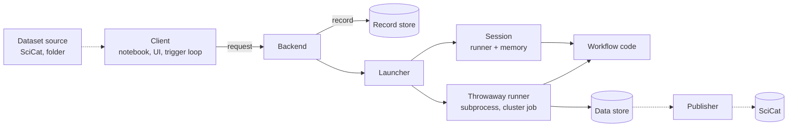

# Architecture of the ESS data-reduction framework

This document explains the design in about thirty minutes.
[README.md](README.md) is the five-minute version, and [scoping.md](scoping.md) states the goals.
Each section here ends with a pointer to a topic document, which holds the details, the rejected alternatives, and the costs.
A walking skeleton under `packages/essapps` implements the design in a single process.
Code examples in this document use the skeleton's API, and the [components table](#components) names the module for each part.
Terms are defined in the [glossary](glossary.md).

## The picture


```mermaid
flowchart LR
    client["Client<br/>notebook, UI, trigger loop"] -- request --> backend[Backend]
    source["Dataset source<br/>SciCat, folder"] -.-> client
    backend -- record --> records[(Record store)]
    backend --> launcher[Launcher]
    launcher --> session["Session<br/>runner + memory"]
    launcher --> throwaway["Throwaway runner<br/>subprocess, cluster job"]
    session --> workflow[Workflow code]
    throwaway --> workflow
    throwaway --> data[(Data store)]
    data -.-> publisher[Publisher] -.-> scicat[(SciCat)]
```

A client submits a **run request**: a spec, its parameter values, and the outputs to compute.
The **backend** validates the request, writes it down as a **run record**, and asks a **launcher** to start a **runner**.
The runner calls the scientific workflow code and stores the outputs.
An output of one run record can be an input of the next run request.
Interactive work happens in a **session**, a process that keeps data in memory between runs.
Batch and automatic reduction make many requests from one stored **template**, a partial request whose blanks each request fills.
Publishing a result to SciCat is a separate, deliberate step.

## Requests, records, references

Two runs from a notebook, the second taking an output of the first:

```python
run = dataset_ref(instrument='dream', run=1)            # a run number, resolved at submit
loaded = client.run(LOAD, {'run': run, 'scale': 2.0})
hist = client.run(HISTOGRAM, {'data': loaded.ref('data'), 'bins': 8})
```

The run record of the second run, abridged:

```json
{
  "id": "3f9a1c0b77e2",
  "request": {
    "spec": {"name": "histogram", "version": 1},
    "params": {"data": {"record": "b41c22d90a61", "output": "data"}, "threshold": 0.0, "bins": 8},
    "outputs": ["histogram"],
    "instrument": "dream", "proposal": "p1",
    "submitter": "me"
  },
  "status": "completed",
  "package_versions": {"scipp": "26.8.0", "essdiffraction": "26.9.0"},
  "environment": "dream-2026-09",
  "stored_outputs": [{"record": "3f9a1c0b77e2", "output": "histogram"}]
}
```

The design mirrors what sciline does with a pipeline:

```python
pipeline[Masks] = masks                                   # parameters set: spec and params
pipeline[QBins] = q_bins
pipeline.compute(IofQ)                                    # a plain run: a run record
stage = sciline.Stage(pipeline, inputs=[QBins], outputs=[IofQ])
stage.compute({QBins: q})                                 # one call of a stage: a run record
```

A **run request** is one run of a spec with every parameter value set, like `compute` on a configured `sciline.Pipeline`.
It holds the spec, its `params`, and the outputs to compute.
When the backend accepts a request, it fills into `params` the spec's default for every parameter not given, and records every value in the form the params model gives it, so the record holds every value the run used.
A call of a stage is a run request too, whose `params` and outputs equal those of a plain run with the same values: where a session cuts the pipeline does not change the result, so the record does not say ([Interactive work](#interactive-work)).
A run request is plain JSON-serializable data, even when it never leaves a process.
It never names a session, a process, or a storage location.

A **run record** is the run request plus what happened to it: status, timestamps, outputs, package versions, and the environment.
The recorded parameter values, the package versions, and the environment make "recompute this record" meaningful after a default changes or a package is upgraded.
A run record is immutable once the run completes.

A **reference** is the only way a request names data. It has two forms:

| Form | Names | Example |
|---|---|---|
| Output reference | output X of run record Y, optionally one element of a collection output | `{"record": "b41c…", "output": "data"}` |
| Dataset reference | data the framework did not compute: a SciCat dataset or a local file | `{"dataset": "pid:20.500.12269/abc"}`, `{"dataset": "uuid:05165700-…"}` |

A reference names data by identity, never by where the bytes are.
A dataset is identified by its SciCat PID, the UUID its NeXus file carries, or the sha256 of a local file's bytes, and a reference by any of these it has names it; a new record uses the first it has, and a moved file keeps it.
Where a dataset's bytes are is asked of SciCat, or of the user's folder, when the run is dispatched.
Records keep references in reference form.
**Provenance** is therefore the graph obtained by following references from a result back to datasets, parameters, and software versions.
No separate provenance model exists.

Three rules complete the model:

- **Stand-ins resolve at submission.**
  A user may type a run number or a path.
  The backend replaces it by the identity of the one dataset it names before it writes the record, because provenance must not depend on a search that could give a different answer later.
- **A missing copy is reported, never silently recomputed.**
  Whether an output is usable is two questions: the record's status, and whether the data store holds a copy.
  Getting a dropped output back is an explicit `recompute`, which makes a new record linked to the old one.
- **Records are not deleted one at a time.**
  A proposal's records and stored outputs are dropped together after an analysis window.
  Stored bytes may be dropped earlier; the record stays.

Details: [records.md](records.md).

## Workflow code behind a spec

A **spec** declares a workflow's interface: name, version, a parameter model, an output model.
It is defined in scipp/ess#690, with the extensions listed in [workflow-contract.md](workflow-contract.md#changes-to-the-spec-of-scippess690).
The simplest workflow is a plain function:

```python
class HistogramParams(BaseModel):
    data: Array(ArraySpec(dims=('x',), unit='counts'))   # holds a reference
    threshold: float = 0.0
    bins: int = Field(default=4, ge=1)

class HistogramOutputs(BaseModel):
    histogram: Array(ArraySpec(dims=('x',), unit='counts'))

HISTOGRAM = WorkflowSpec(name='histogram', version=1,
                         params=HistogramParams, outputs=HistogramOutputs)

def histogram(params: HistogramParams, inputs: Inputs) -> dict[str, Any]:
    data = inputs.array(params.data)       # or inputs.path(ref) for a NeXus file
    kept = drop_below(data, params.threshold)
    return {'histogram': kept.hist(x=params.bins)}
```

- **A spec is the signature of a pipeline**: every parameter, and every value a caller may ask for.
  Beside its results, a spec may expose **intermediates**, values inside the pipeline that a request may name as outputs, such as a detector image.
  The spec says nothing about which value depends on which parameter; only the workflow code knows the graph.
- **The workflow builds the stages a session holds.**
  Its protocol is one method: `stage(params, inputs, outputs, data)` takes the parameters not varied and returns a callable from the varied parameters to the outputs.
  A plain run is the stage with no inputs, and a plain function is a workflow whose stages hold nothing.
  The function `histogram` above shows the contract.
  The skeleton binds `HISTOGRAM` through the sciline adapter, so a session can hold its stages.
- **Inputs are parameters.**
  A parameter that holds a reference is what this document calls an input.
  Outputs are declared in the same type vocabulary, so checking that an output may feed a parameter is a type check between two fields.
- **The code asks for the form it wants**, a local path or a scipp object.
  Where the bytes come from is the runner's business: a session's memory, the data store, or a work directory.
  The code cannot tell, so the same workflow code runs in a notebook session and in a cluster job.
- **Workflow code never writes files.**
  It returns objects by field name, and the runner validates and stores them.
- **The framework never imports sciline.**
  An adapter, which belongs in ess.reduce, turns a sciline pipeline into a workflow, and each run into a call of a `sciline.Stage`:

```python
PipelineAdapter(
    sciline.Pipeline([filter_data, histogram]),
    keys={'data': RawData, 'threshold': Threshold, 'bins': Bins},   # field -> sciline key
    resolve={'data': 'array'},                                      # form of each reference
    targets={'histogram': Histogram},                               # output field -> key
)
```

Installed packages provide specs and workflow factories through two entry-point groups.
The backend loads specs only, so it validates requests without importing workflow code.
Validation has three layers: JSON Schema, the pydantic parameter model, and runnability (references resolve, the submitter may read them, a launcher has the spec).
Every request is checked against the whole parameter model.

Details: [workflow-contract.md](workflow-contract.md).

## Where a run executes

Batch reduction, automatic reduction, and provenance need runs that describe their result completely and need no human present.
Interactive work needs the opposite: fast reruns over large intermediates held in memory.
The design pins "stateless" on the record and allows state in the process that executes it.

A run executes in one of two shapes:

| | In a session | In a throwaway process |
|---|---|---|
| Process | lives as long as its client wants | one run, then exit; subprocess or cluster job |
| Inputs | from the session's memory when it holds them | fetched from disk |
| Outputs | stay in memory; written only when asked | written to disk before completion is reported |
| Used for | interactive work | batch, automatic reduction, everything in shared mode |

A **session** belongs to one client and holds the outputs of its run records, and the stages it built for them (next section).
Two invariants keep it safe:

1. Session identity never appears in a record.
2. Everything a session holds can be recomputed from records.

A session is therefore a cache.
Losing one costs time and nothing else.

The client interface follows the same line:

3. Every client method sends one plain-data request and gets references back, and the client holds no state that the records cannot rebuild.

A stage a client names is a **template**, which is plain data: the spec, the values set, the blanks each request fills, and the outputs.
`client.run(template, values)` fills the blanks, sends one run request, and returns a run record whose outputs are references.
Where a value lives and where a stage runs are the backend's choice and invisible to the caller.
What a stage computes is not: it is in the request as plain data, never as a sciline object, because a record must be recomputable from its request alone and a shared backend must validate what it accepts.
A long-lived holder of state, such as a runner that holds the stage of a growing series ([aggregation.md](aggregation.md#a-series-under-a-rule)), satisfies the rule only by writing records it can be rebuilt from.
The second invariant holds for every value the system keeps in memory, which is what lets a growing sum over runs be accumulated from disk or in memory interchangeably.
It holds because reduction here consumes datasets.
It would not hold for a live stream, which is esslivedata's problem and out of scope.

The **data store** is a registry of disk copies plus a disk tier, addressed by reference.
Each process also has a private memory cache.
The registry never learns about memory caches, so no cache-coherence protocol exists, and the backend never waits on a user's process.

The framework runs in two modes.
In **local mode**, client, backend, launcher, session, and data store are one Python process: a notebook.
In **shared mode**, the backend is a service for one instrument, every run is a throwaway process, and sessions come later.
The skeleton implements local mode, with a subprocess launcher as the throwaway shape.

Details: [records.md](records.md#where-runs-execute-and-where-data-lives).

## Interactive work

A person tuning a reduction moves one parameter at a time, and expects a plot to follow.
Each move is a new, complete run request with its own run record.
Three mechanisms make that fast and presentable.

**Stages make reruns cheap.**
The client names the stage before the first call, as a template: the parameters that stay fixed, and the moving one as a blank.
The caller knows which parameter will move: a UI author knows which widget drives which parameter.
The session builds the stage on the first call and holds it.
A stage holds everything its inputs cannot affect, such as the loaded and coordinate-converted data, and each call computes only what lies downstream of the stage inputs.
The sciline adapter builds a `sciline.Stage` (scipp/sciline#245).

```python
hist = Template(spec=HISTOGRAM, params={'data': data}, blanks=('bins',), name='hist')
first = client.run(hist, {'bins': 2})
second = client.run(hist, {'bins': 8})                 # served by the held stage
assert second.reused and client.latest('hist').id == second.id
```

Each call is a run request with `bins` in `params`, under the template's name as its label.
`client.run` submits it with the template's blanks as `vary`, a hint for the session that is not recorded.
The session holds the stage under a name made of the spec, the values not varied, the varied names, and the outputs.
Each call's `params` and outputs equal those of a plain run with the same values.
The label, the origin, and `reused`, which says that a held stage served it, can differ.
Recomputing it needs nothing from the session.

**Labels keep hundreds of reruns from being what a person sees.**
A request may carry a **label**.
The latest record under a label supersedes the earlier ones, and each record links to the one it superseded.
An interactive tool owns a label, called its **slot**; comparing two variants side by side is two labels.
The same field serves batches and rules below.

**Views serve plots.**
A **view** is a small piece of an output for display: slicing, reduction over dimensions, downsampling.
It returns plain arrays, is served by the process that holds a copy, is not recorded, and is never an input of a run.
Dragging through slices of a 4D volume creates no records and never sends the volume to the frontend.
When a user wants to compute from a slice they found, the slice specification becomes a parameter of the next request.

Details: [stages.md](stages.md).

## Chaining

Requests submitted together may reference each other's outputs before those exist:

```python
group = client.submit_group({
    'a': client.request(LOAD, {'run': run_a}),
    'b': client.request(LOAD, {'run': run_b}),
    'sum': client.request(SUM, {'runs': [OutputRef(record='@a', output='data'),
                                         OutputRef(record='@b', output='data')]}),
})
```

The backend validates the group whole, creates all records, and holds each request until every record it references has completed.
A request fails if a record it references fails, and is cancelled if one is cancelled.
This **pending output as input** is the only scheduling primitive.
Vanadium feeding a sample reduction, a temperature scan followed by a sum, an angle series, and a sum spread over nodes all use it.

One rule for workflow authors follows: **a value that other requests reference must be an output of a run record.**
An exposed intermediate, such as a detector image, can be such an output, so reuse does not force a cut into separate specs.
A value from outside is a parameter whose field accepts a reference, as `ess.apps.loki` binds the beam centre:

```python
class IofQParams(BaseModel):
    ...
    beam_center: Quantity | OutputRef          # typed in, or taken from another run

centre = client.run(BEAM_CENTER, {'sample_run': run, ...})
client.run(IOFQ, {'sample_run': run, 'beam_center': centre.ref('center'), ...})
```

The run record of the reduction names the run record the beam centre came from.
A parameter typed `Quantity | OutputRef` is how a value that another run computes can also be typed in, so a value from outside needs no mechanism of its own.
Separate pipelines, such as vanadium processing and the sample reduction, remain separate specs.

Details: [records.md](records.md#scheduling-pending-outputs-as-inputs).

## Aggregation over runs

Many reductions combine several runs into one result.
A sum over runs is one run request whose run parameter is a list:

```python
total = client.run(NORMALIZE, {'runs': runs, 'floor': 1.5, 'scale': 2.0})
total.request.params['runs']                   # the record names every run it sums
```

The spec declares `runs: list[OpaqueFile]`, and the backend validates the request like any other.
The package provides a `sciline.Aggregation` over the pipeline, which accumulates the values that add, such as a numerator and a denominator, and the binding drives it:

```python
PipelineAdapter(normalize_pipeline(), keys=..., targets=...,
                aggregations={'runs': normalize_aggregation})
```

The adapter contributes each run through the aggregation and accumulates, inside one run.
It uses only the contribute half and builds its own final stage ([workflow-contract.md](workflow-contract.md#the-sciline-adapter)).
The framework never adds arrays and knows nothing about scipp or normalisation.
A value that differs per run makes each element of the list a row, whose fields are the columns of sciline's member table.
Sample runs and background runs are two list parameters of one plain run.

Stages and accumulations are caches.
In a session, a template whose blank is the list names a stage that holds the accumulation over the runs it has seen, so adding a run to the list reduces only that run.
A rule with a series submits, on each arrival, one request over every current run of the series.
To reduce the runs of one sum on separate nodes, the author splits the sum into a contribute spec and a combine spec, both built from the one aggregation, and a client composes them over references, like any chain.
What the workflow does with a list is its own business, so a stitch over angles is a spec over a list as well.

Details: [aggregation.md](aggregation.md).

## Batch and automatic reduction

Both make requests without a person filling a form, and they are one mechanism.
Three kinds of stored, versioned data drive it:

| Stored data | What it is |
|---|---|
| **Template** | a partial request: the values set, and the blanks each request fills, typically the data references |
| **Lookup** | a table beside a template: entries match dataset fields and supply fills, e.g. a Q range per angle |
| **Rule** | a template, a lookup, and a selector that picks datasets, or the completed records of a rule it follows; optionally a series |

```python
rule = Rule(
    name='subtract',
    template=Template(name='subtract-defaults', spec=SUBTRACT.id,
                      blanks=('sample', 'can'), dataset_field='sample'),
    lookup=Lookup(name='cans', entries=(
        LookupEntry(name='can', fills={'can': Nearest(match={'role': Like(pattern='can')})}),
    )),
    selector=Selector(match={'role': Like(pattern='sample')}),
)
group = apply(client, rule, datasets)      # preview through validate, then submit whole
```

- **`apply` is the one operation that makes requests.**
  It fills the template for each dataset and returns a group to preview and submit.
  The group carries the template's blanks as what its members vary, so in a session members that agree on every other value share a held stage.
  Values come from one ladder: template, then lookup entry, then what the submitter pinned.
  A person at a batch form calls it with a list of datasets, and the trigger loop calls it with each new dataset.
  Backlog, reprocess, and retry call it with a query.
- **A batch is the records under one label**, each with a **member key**.
  Nothing else is stored.
  The batch table is a query: the latest record per member key.
  A rule's records carry the rule's name as label and the dataset as member key, so the status page of automatic reduction is the same table.
- **The trigger loop keeps no memory.**
  It fires a rule on a dataset when the selector matches and no record exists under the rule's label for that dataset.
  Every condition is a query over records and datasets, so a restart neither loses nor repeats work.
  A request that needs a dataset still to come, a can measured after the sample, waits until a later pass.
- **A rule with a series key submits one request over every run of the series so far**, on each arrival or once the series is complete, and it supersedes the previous one.
- **A rule may follow another** and fire on its completed records: a combine over the contributions of a series, or one request per key a first phase found.
- **Dataset fields come from instrument code.**
  A field extractor, registered per instrument, derives role, sample, angle, and start time from the catalogue entry and the file; nothing is required of acquisition.

A rule is to a batch what a template is to a request.
A template is also the stage a client names for a slider, so the batch form and the notebook use one concept.

Details: [rules.md](rules.md).

## Publication, scope, deployment

- **Only finalized data enters SciCat**, because data in SciCat cannot be removed.
  Publication is an explicit, idempotent operation on one output.
  The SciCat entry carries a provenance snapshot that can be read without any service of ours.
  A result that a held stage served is refused until it is recomputed in a throwaway process.
- **The record store is not a catalogue.**
  It answers what was computed; SciCat answers what was measured and what was published.
  Nothing is stored per dataset.
- **Instrument plus proposal scopes everything**: both are mandatory on every record, and the proposal owns the record.
  A request may name datasets and records of any proposal its submitter may read, such as a direct beam from the instrument's commissioning proposal.
- **One backend per instrument in phase 1**, each with its own record store and data store.
- **The Python client interface is the API.**
  Every UI reaches the backend through it.
  HTTP is a transport under it: a server holds the backend, and a remote backend forwards each call.

Details: [operations.md](operations.md).

## When things fail

- A retry is a new record that links to the failed one. A status is never reset.
- A failed record carries a structured reason, so a user sees why without reading logs.
- A throwaway runner writes a completion marker after its outputs. A backend that was down reconciles from markers when it returns.
- A runner that cannot reach storage pauses its run. A slow filesystem does not cost a retry per run.
- Losing a session fails the runs in flight there, and nothing else.

Details: [operations.md](operations.md#failure-handling).

## Components

| Component | Responsibility | Skeleton module (`ess.apps`) |
|---|---|---|
| Client interface | the API: templates, request, validate, submit, run, view, pick, publish | `client`, `records` |
| Transport | the `Backend` protocol over HTTP: the server holds a `LocalBackend`, `RemoteBackend` forwards each call | `server`, `remote` |
| CLI | serve a backend; list specs and datasets, submit, wait, read an output, and publish from a shell | `cli` |
| Backend | validates, resolves stand-ins, writes records, schedules, dispatches; single writer of the record store | `backend` |
| Record store | run records and queries over them; SQLite | `records`, `store` |
| Data store | registry of disk copies, disk tier, private memory cache | `datastore` |
| Launcher | decides where a run executes: session or throwaway process | `launcher` |
| Runner | calls the workflow, validates and stores outputs | `runner` |
| Session stages | holds the stages the session built, by the name its requests give them | `stages` |
| Spec and binding | spec extensions, exposed intermediates, entry points, `Inputs`, the workflow protocol | `spec`, `binding` |
| Sciline adapter | a pipeline as a workflow: each stage a `sciline.Stage`, list parameters through the package's `sciline.Aggregation` | `adapter` |
| Dataset source | lists datasets with the fields a field extractor derives; persists nothing | `sources` |
| Rules | templates, lookups, rules, series; `apply`; trigger loop | `rules`, `batch` |
| Views | slices and reductions for display | `views` |
| Test helpers | a stage returns what a plain run returns; fakes of a dataset source and a publisher | `testing` |
| Example workflows | toy specs; LoKI SANS and Amor reflectometry on real workflows | `examples`, `loki`, `amor` |

`packages/essapps/README.md` is a guided tour, and `notebooks/loki-session.ipynb` runs one interactive LoKI session on the esssans tutorial data.

## Decisions at a glance

Each row names a decision, its main reason, and what was rejected.
The linked document argues the case and lists the costs.

| Decision | Because | Instead of |
|---|---|---|
| [Data is named by reference](records.md#references) | one mechanism serves inputs, provenance, scheduling, and publication | file paths in requests; a separate provenance model; opaque data handles |
| [Stateless records, stateful sessions](records.md#where-runs-execute-and-where-data-lives) | batch and provenance need complete records; interactive work needs memory | stateful jobs as in esslivedata; disk-only runs; shared memory across processes |
| [A stage is a template, and a template is plain data](#where-a-run-executes) | where values live and where stages run can change without changing a caller; a record stays recomputable from its request | sciline objects or remote proxies of them in the API; client objects that hold a configured pipeline |
| [Memory caches are private](records.md#the-data-store) | a registry of other processes' memory needs a coherence protocol | a registry that tracks in-memory copies |
| [Run records, defaults filled at submit](records.md#requests-and-records) | a record holds every value it ran with; where a session cuts the pipeline is a hint given with the submission and not recorded | a stage record that holds the cut; the varied names on the record; a stored workflow record holding only the values given |
| [Reuse means a run record](records.md#reuse-means-a-run-record) | a referenced value needs a record | references to values that no run record outputs |
| [Own record store, single writer](records.md#the-record-store) | no engine offers a stateless request that a notebook, a loop, and a UI can all emit | AiiDA, Snakemake, Prefect; a message broker |
| [Pending outputs as inputs](records.md#scheduling-pending-outputs-as-inputs) | the smallest addition that covers chaining, and sums spread over nodes | a general DAG scheduler |
| [The workflow builds the stages a session holds](workflow-contract.md#the-workflow-protocol) | one execution path for plain runs, reruns, and sums, in every runner; only the workflow code knows the graph | a file-based contract; a framework that knows sciline; a summary of the graph in the spec |
| [The caller names the stage as a template's blanks, the session holds it](stages.md#who-names-the-stage) | the caller knows which parameter will move | stage inputs inferred from successive requests; stage inputs declared by the workflow author; state kept inside workflow code |
| [Views are not runs](stages.md#views) | exploring data must not create records or move volumes | views as recorded runs; sending scipp objects to the frontend |
| [One label field](rules.md#labels-batches-and-slots) | slots, batches, and rules share one query for latest, cancel, and evict | a slot object, a batch object, and a rule status table |
| [A sum over runs is one run over a list of runs](aggregation.md) | a record says what it sums; the backend needs no graph; the binding drives the package's aggregation and the framework stays ignorant of scipp | member and finalize records with supplied intermediates; contribute and combine specs with `carry`; an aggregation spec; summation in the framework |
| [A rule is to a batch what a template is to a request](rules.md) | batch and automatic reduction are one mechanism | a separate autoreduction service with its own state |
| [The trigger loop keeps no memory](rules.md#the-trigger-loop) | a restart can neither lose nor repeat work | a cursor or a table of seen datasets |
| [Publication is explicit](operations.md#publication) | SciCat entries cannot be removed | writing every output to the catalogue |
| [The Python client interface is the API](operations.md#the-client-interface) | one API keeps UIs out of backend internals; HTTP is a transport under it | HTTP and TypeScript from the start; a Qt application |

## Status

The skeleton covers both execution shapes, run records, group submission with pending outputs, the sciline adapter with session-held stages, labels, dataset references with a folder source, sums over runs as list parameters, lookups with nearest fills, rules over datasets and over completed records, `apply`, reprocess, the trigger loop, publication, and the HTTP transport with a server and a CLI.
LoKI SANS and Amor reflectometry are bound to it.
Not in it: a SciCat dataset source, a cluster launcher, remote sessions, a UI, and a store for templates and rules.
What binding the two real workflows found, the open questions, and the deferred items are in [open-issues.md](open-issues.md).

[roadmap.md](roadmap.md) maps the design onto the three delivery phases: automatic reduction, batch reduction, and interactive applications.
[user-stories.md](user-stories.md) holds the user stories that the design is checked against.
Studies that read an earlier edition of the design against Snakemake, AiiDA, Mantid's ISIS interfaces, and git are in `prior-art/`, with a later one on ewoks. They are not maintained.
