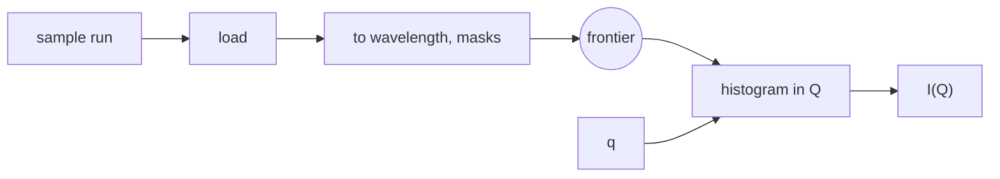

# Interactive work: sessions, stages, slots, and views

This document covers how a person tunes a reduction interactively: what a session holds, how a rerun avoids repeating expensive work, how hundreds of reruns stay presentable, and how plots get their data.
It is the detail behind ["Interactive work" in architecture.md](architecture.md#interactive-work).
Interactive work decides whether people will use the framework instead of a notebook, so this part of the design carries the most risk.

## The requirement

A person reducing SANS data loads a run of several gigabytes, converts coordinates, and then adjusts Q bins, a wavelength range, or a beam centre while watching I(Q).
Loading and converting take seconds to minutes.
Everything after them takes a fraction of a second.
In a notebook the person gets this split for free: the loaded data sits in a variable, and only the last cells run again.

The framework must give the same response time.
It must also keep its own promise that every result has a complete record.
The `loki-session.ipynb` notebook in the skeleton shows both on the esssans tutorial data: a rerun with changed Q bins takes about a quarter of a second instead of three, and each rerun has a record that reproduces it from raw data.

```python
for num_bins in (50, 100, 200):
    q = QEdges(start=0.01, stop=0.3, num_bins=num_bins)
    record = client.run(IOFQ, {**params, 'q': q}, label='iofq')     # ess.apps.loki.IOFQ
    plot(client.view(record.ref('iofq')))
```

Every call submits a complete request.
The first builds what it needs, and the later ones reuse it.
The rest of this document explains how.

## What a session holds

A **session** is a runner process that belongs to one client and lives as long as the client wants.
It holds two things in memory:

- the **outputs** of the records it ran, so that a chained request gets its input without a disk read;
- **stages**, which hold intermediate results of a workflow.

Both are caches over records, by the two invariants in [records.md](records.md#where-runs-execute-and-where-data-lives): a record never names a session, and everything a session holds can be recomputed from records.
Closing or losing a session loses time, and nothing else.

A workflow holds nothing between calls.
All state between runs is in the session, where the session can see it, bound it, and drop it.

## What a stage is

sciline's `Stage` (scipp/sciline#245) is the part of a pipeline from named input keys to named output keys.
When it is built, it computes everything the inputs cannot affect and holds those values at its **frontier**.
Each call supplies the inputs and computes only what lies downstream of them.



With the Q bins, field `q`, as the only stage input, the frontier holds the converted events.
A call with new Q bins runs the histogram and the normalisation, and nothing else.

A `Stage` recomputes everything downstream of all its inputs on every call.
A stage whose inputs are `q` and the sample run therefore loads the run again when only `q` changes.
Which parameters are stage inputs decides what a rerun costs.
It never decides what a rerun returns.

## The stage offer

The framework does not import sciline, so it sees stages through an interface in field names.
Beside its callable, a workflow may offer a stage (`ess.apps.binding.StagedWorkflow`):

```python
class StagedWorkflow(Protocol):
    default_stage_inputs: Collection[str]

    def __call__(self, params: BaseModel, inputs: Inputs) -> Mapping[str, Any]: ...

    def stage(self, params: BaseModel, stage_inputs: Set[str], inputs: Inputs) -> Workflow: ...
```

`stage` returns a callable with the workflow's own signature.
It accepts every request that equals `params` in all fields outside `stage_inputs`, and for those it must return what the workflow returns:

```python
wf.stage(p0, stage_inputs, inputs)(p, inputs) == wf(p, inputs)
```

It may hold whatever the stage inputs cannot affect.
What it holds is a cache, so dropping a stage is always safe.
A plain function offers no stage, and the session calls it directly.

## Who chooses the stage inputs

**The session chooses, from what the person changes.**
The workflow author cannot make the choice, because no fixed choice serves both "tune one parameter" and "the same settings over many runs".
The Amor reflectometry binding showed this: its author named the sample run, the number of Q bins, and a scale factor as stage inputs, so a change of the Q bins loaded the run again.
Only the session sees which parameter moves.

The rule has three parts. `ess.apps.stages.Stages.workflow_for` implements it in about forty lines.

```python
def workflow_for(request):
    held = [s for s in stages
            if s.spec == request.spec and s.fixed_values == request.values_outside(s.stage_inputs)]
    if held:
        return min(held, key=lambda s: len(s.stage_inputs))     # recomputes least

    predecessor = superseded_request(request) or latest_request_under(request.label)
    stage_inputs = fields_that_differ(request, predecessor) or workflow.default_stage_inputs
    if not stage_inputs:
        return workflow                                          # hold nothing
    return hold(workflow.stage(request.params, stage_inputs, inputs))
```

1. **A stage is addressed by what it holds.**
   The address is the spec, the stage inputs, the values of all other fields, and the checksums of the datasets among them.
   Values are compared as plain data, so a reference compares as a reference and nothing is loaded for the comparison.
   The checksums keep a file that changed on disk from finding a stage built from its earlier bytes.
   A request is routed to a held stage whose fixed values equal its own.
2. **If no stage matches, the stage inputs are the fields in which the request differs from its predecessor.**
   The **predecessor** is the request it supersedes under its label, or, for a new member of a batch, the latest request under the label.
   A slider therefore names its own stage input.
   A batch over runs names the columns of its table.
   A correction to one batch member names the corrected field.
3. **A request without a predecessor has nothing to differ from.**
   The adapter may name `default_stage_inputs` for that case.
   The default saves one full computation per series of reruns, and nothing depends on it.
   Without a default, the session calls the workflow and holds nothing.

A stage belongs to no label.
Two plots that move the same parameter on the same data are routed to one stage, so the loaded data is held once.
The label serves only to find the predecessor.

The session holds a bounded number of stages and drops the least recently used.
A stage resolves the references among its fixed fields when it is built and holds those objects.
They count towards the session's memory, and they stay valid when the session's output cache drops its own copy.

### What this costs

The first move of a parameter that is not yet a stage input costs one full computation, because its stage must be built.
A person who moves two parameters in turn pays that cost on every switch, unless both changed in one request, which builds one stage with both as inputs.
Making the switch cheap needs values held between two consecutive stages.
That is the network of stages which scipp/sciline#245 deferred.

## The sciline adapter

`ess.apps.adapter.PipelineAdapter` implements the stage offer for a sciline pipeline:

```python
def stage(self, params, stage_inputs, inputs):
    pipeline = self._pipeline.copy()
    set_on(pipeline, fields_outside(stage_inputs), params)         # resolved once, now
    stage = sciline.Stage(pipeline, outputs=targets, inputs=keys_of(stage_inputs))
    return lambda params, inputs: outputs_of(stage.compute(values_of(stage_inputs, params)))
```

A stage input that the targets do not need is held and ignored, although sciline's `Stage` would refuse it.
Such an input cannot change the result, and a caching choice by the session must not decide whether a run succeeds.

Correctness follows from the sciline graph for any choice of stage inputs, provided the providers are pure.
The test helper `ess.apps.testing.assert_stage_equals_workflow` checks the contract: it drives a workflow through a sequence of requests, once through held stages and once directly, and asserts equal outputs.
Every workflow that offers a stage runs it.
`tests/stages_test.py` shows the routing rules one by one.

## Reruns and their records

Every call through a stage is a complete request and writes a complete record.
From the framework's side there is one kind of rerun.
Changing a threshold and adding one more run to a sum are both a full parameter set that differs from the previous one in one field.

The record carries a `reused` flag, which says that a held stage served it.
Publication reads the flag and recomputes such a result in a throwaway process first, so that what enters SciCat was computed without held state.
See [operations.md](operations.md#publication).

A session holds the code it imported.
A change to workflow code takes effect in a new session, never in a running one.

## Slots

A slider dragged across its range submits dozens of requests.
All of them are correct records, and none but the last is what a person wants to see.

A **slot** is a label that an interactive tool owns.
A **label** is a field on a request, and the latest record under a label supersedes the earlier ones.
[rules.md](rules.md#labels-batches-and-slots) defines labels, which batches and rules use as well.
For interactive work this means:

- The client interface supplies a label whenever a request reruns a spec in a session, so a notebook user gets a slot without asking for one.
- A plot, a record browser, and a replay tool identify a series of reruns by its slot. The slot is the stable identity across superseded records.
- Comparing two variants side by side is two slots. The second is assigned when the user forks. Discarding a variant drops its label from the UI and changes nothing else.
- Cancelling the queued predecessors of a slot is one client call.
- Inspection shows the latest record with its difference from the record it superseded: "one value changed" for a slider, "one more contribution" for a growing sum.
- The data store evicts outputs of superseded records first.

A slot adds nothing to the record model.
esslivedata needed the same split between a stable data key and a key per result (scipp/esslivedata#1062).

## Views

A plot needs a small array.
An output may be a 4D volume of many gigabytes.

A **view** is a request for a small piece of an output for display.
Its vocabulary is label-based slicing, reduction over dimensions such as sum or mean, and downsampling to a display resolution.

```python
client.view(record.ref('volume'), select={'energy_transfer': 12})
# {'dims': ['qx', 'qy'], 'values': ndarray, 'unit': 'counts', 'coords': {...}}
```

- **A view returns plain arrays** with coordinates, units, and masks, not a scipp object. Any plotting stack can consume it, and plopp in a notebook is one.
- **A view is a pure function of a reference and a view specification.** The process that holds a copy serves it: a session for its own outputs, the shared service for disk copies it has loaded. Dedicated view workers can take that role later.
- **A view is not recorded and is never an input of a run.** Dragging through slices creates no records. When a user wants to compute from a slice they found, the slice specification becomes a parameter of the next request, which keeps provenance exact.
- **Anything beyond slicing, reduction, and downsampling is a workflow.** That includes the difference of two runs. Overlaying several runs in one plot is several views.
- **Event data is never viewed, and neither is a raw file.** A workflow that ends in binned events also declares the histogrammed output that people look at, and the output's `ArraySpec` marks which is which. A quick look at a run just measured goes through a preview spec per instrument.

In local mode a client may also turn a reference into a scipp object with `client.output`, so plopp and the full scipp API work in a notebook.
The skeleton's `ess.apps.views` implements index selection only.

## More than one workflow

Tuning two workflows together, such as vanadium processing and the sample reduction that takes its result, uses a stage of each.
The output of the first is a record's output that the session holds in memory, and the second references it.
No disk access happens between them.

A sum over a growing list of runs needs nothing beyond stages and held outputs.
See [aggregation.md](aggregation.md#in-a-session).

## Where sessions run

A session is defined by its owner, not by its location.
At first it exists only in local mode, where the notebook process is the session.
Later it may run on the backend host, or in a client process on the user's machine while expensive requests run on a cluster.
Remote sessions need a session launcher, an idle timeout, and a cap on sessions, and are deferred for that reason.
Until they exist, the shared web UI has no interactive loop.

## Sessions are one of three models

Sessions are not the only way to give a person fast reruns.
Two other models meet the same requirement, and all three share the records, the spec vocabulary, the client interface, and the callables.
They differ in where the interactive state lives.

**The session model** is what this document describes.
State lives in a session that the framework knows about.
Every rerun is a complete record in a slot.
The stage contract and its test helper guarantee that a result through a stage equals the direct one, and publication recomputes without a stage.
Interactive work in the shared web UI needs remote sessions, which the framework must launch, route requests to, time out, and cap.

**The checkpoint model** keeps the state in the application's process, and the framework does not know about it.
The application holds the stage, reruns it in memory as a notebook does, and plots with plopp or with the view function called in-process.
None of that creates records.
When the user keeps a result, the application submits the complete parameter set as an ordinary request.
The request runs in a throwaway process and yields a record that cannot be told from a batch member.
The application may compare that output with what was on screen and warn if they differ.
Shared interactive use is a hosting question, a process per user as JupyterHub provides, and the framework never sees a session.

**The stateless model with splits** has no state between runs.
The workflow author cuts the workflow where the expensive part ends, so that its result is a stored output of a record.
On the first rung, every rerun is a throwaway process that reads that output and runs the cheap part.
On the second rung, runners stay alive and keep their outputs, and the launcher routes a request to the runner that already holds its input.
A routing miss falls back to the first rung, so the second rung is an addition to the first.

| | Session | Checkpoint | Stateless with splits |
|---|---|---|---|
| Feedback on a post-processing parameter | under a second | under a second | seconds; under a second on the second rung |
| Records created while exploring | one per change, grouped by slots | none | one per change |
| Provenance of a kept result | complete | complete | complete |
| What the user saw equals the record | by the stage contract and its test helper | checked once, when the result is kept | by construction |
| Framework concepts added | session, held stages, slots, private caches, two execution shapes | none; the adapter becomes a library for applications | none on the first rung; a placement policy and a memory index on the second |
| Interactive use in the shared web UI | remote sessions owned by the framework | a hosted process per user, owned by infrastructure | works, slowly; on the second rung without a process per user |
| Disk volume | low | low | high; lower on the second rung |
| Burden on workflow authors | none beyond the adapter | none beyond the adapter | a cut at every boundary a person tunes across |
| Losing the process | lose time; every step was recorded | lose the exploration since the last kept result | lose nothing |
| Exploring a large volume | views from session memory | views from the application's memory | needs a chunked layout on disk |
| Keeping a result | already a record; recomputed before publication | one full computation per kept result | already a record |

On the first rung of the stateless model, two [user stories](user-stories.md) fail: tuning a SANS reduction with feedback within a second or two, and tuning vanadium and sample together, where each change to the vanadium runs both parts again.

How a growing series is combined does not depend on the model.
It is a chained combine in all three ([aggregation.md](aggregation.md#when-chaining-is-valid)).

### What a rerun costs without held state

Orders of magnitude, not yet measured:

| Step | Session | Throwaway process |
|---|---|---|
| Process start and imports of scipp, sciline, and the instrument package | none | 2 to 5 s |
| Reading a large binned intermediate from scipp HDF5 | none, in memory | 1 to 10 s |
| The expensive part, such as loading and converting a SANS run | none, held at the frontier | 10 s to minutes |
| The cheap part, such as histogramming in Q | under 1 s | under 1 s |

With a cut after the expensive part, a rerun in a throwaway process pays the first two rows.
That is "change and press run", not a slider.
A pool of idle runners with imports done removes the first row.
It is a launcher detail, because state still crosses processes only through disk.

### Kept runners

Removing the second row needs runners that keep their outputs, and a launcher that routes a request to the runner holding its input.
A kept runner is addressed by the reference it holds and the code version it runs, not owned by one client.
The session invariants survive, because the address is derived from the request and no process identity enters a record.
A request that reaches a runner without the input in memory reads disk or recomputes, which is the path without kept runners.
Two people tuning from the same intermediate share one copy, and no process per user has to be launched, timed out, or capped.

The cost is placement, not transfer:

- Something must know which runner holds which output.
  The [data store](records.md#the-data-store) refuses to track memory in processes the backend does not own.
  Over a pool that the backend owns, the index is soft state that a restart discards.
- The placement that maximises reuse destroys fan-out.
  Five hundred batch runs that reference one processed vanadium either queue on the one runner that holds it, or each load it again.
  Deciding when to replicate a small artefact and when to pin a large one is a scheduler feature, and most of the work of this option is there.
- Eviction affects all clients, so the pool needs a byte budget.
  Every eviction makes a routing prediction wrong, so a rerun under a second becomes the typical case and not a guarantee.
- The address includes the code version, so an upgrade fragments the pool.

The [fold](aggregation.md#the-fold) is a kept runner addressed by a series, so both problems would be solved by one mechanism.

### What keeps the choice open

The skeleton implements the session model in local mode.
The model for remote interactive work is not decided ([open-issues.md](open-issues.md#open-questions)).
Three properties of the core keep all three models possible:

- **The callable may ask for an object, not only a file** ([workflow-contract.md](workflow-contract.md#inputs-a-path-or-an-object)).
  A checkpoint application and a session both call workflow code in-process with scipp objects.
- **A client that can reach the disk tier may turn a reference into an object in its own process.**
  An application can then hold its own state without the framework knowing.
- **Nothing in the core requires a request to reach a particular process.**
  A launcher may accept a placement hint, and a scheduler may ignore it.
  This also keeps the HTTP transport, load balancing, and a restart simple.

### What sessions cost in concepts

Without sessions the design loses the session itself, held stages and the stage offer, slots as used by interactive tools, the private memory caches, the second execution shape, the rule that publication recomputes a result a stage served, in-process binding, and session loss as a failure event.
In the skeleton that is about one seventh of the source.
Records, references, the spec vocabulary, the scheduler, rules, the trigger loop, validation, completion markers, publication, and proposal scoping are unaffected.
Batch and automatic reduction use none of the session concepts.

## Alternatives considered

These concern how stages are chosen and held, given the session model.

**Stage inputs named by the workflow author.**
The author fixes which parameters a stage takes.
No fixed choice fits both tuning one parameter and running the same settings over many runs, as the Amor binding showed.
A parameter the author did not name costs a full computation on every change.

**A callable that may hold state, kept by the session runner.**
The session keeps the workflow callable between runs, and the callable caches what it likes.
Session state then sits inside workflow code, where the session cannot see, bound, or drop it: a stage with its own rebuild rule, accumulators for a series with their own staleness rule, caches of contributions shared between callables.
Each workflow author reimplements invalidation, and the framework cannot tell whether a result came from held state.

**The framework caches sciline intermediates itself.**
The framework would have to import sciline.
Caching every intermediate is not affordable with event data, and the graph does not know compute cost or which parameters will vary.

## Costs

- The first move of a new parameter, and every switch between two parameters, costs a full computation.
- Reuse is exact only if providers are pure. The test helper is the check.
- A series of N slider moves is N records. Slots keep that from being what a person sees, and superseded outputs are evicted first.
- A local application in one process shares the interpreter between UI and runs. A long run blocks the UI until sessions can run in another process.
- Through the client interface a user explores declared outputs only, whereas a notebook can compute any node of a sciline pipeline.
- Every workflow that ends in events carries a dense twin, which is one histogram call.
- The view vocabulary is part of the client interface. Dense data needs a chunked layout on disk, so that views on data larger than a cache can read partially.
- How the bound on held stages relates to a memory budget is open. See [open-issues.md](open-issues.md).
